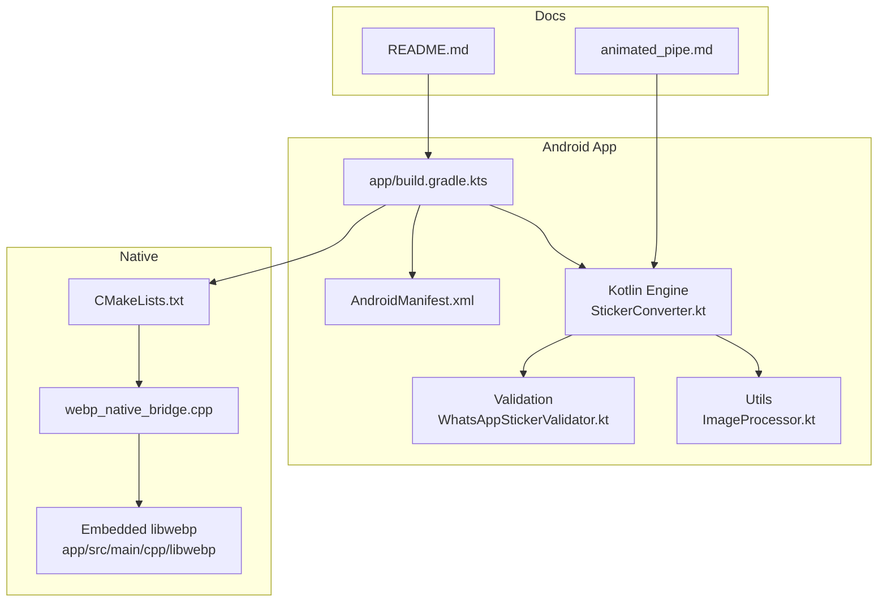
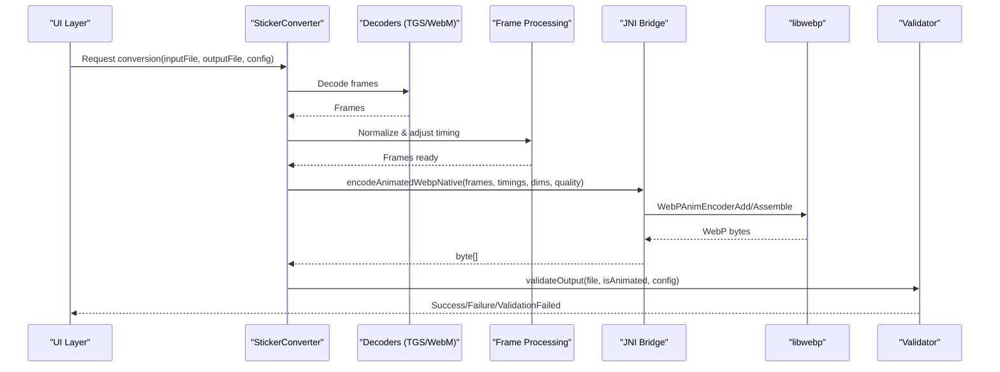
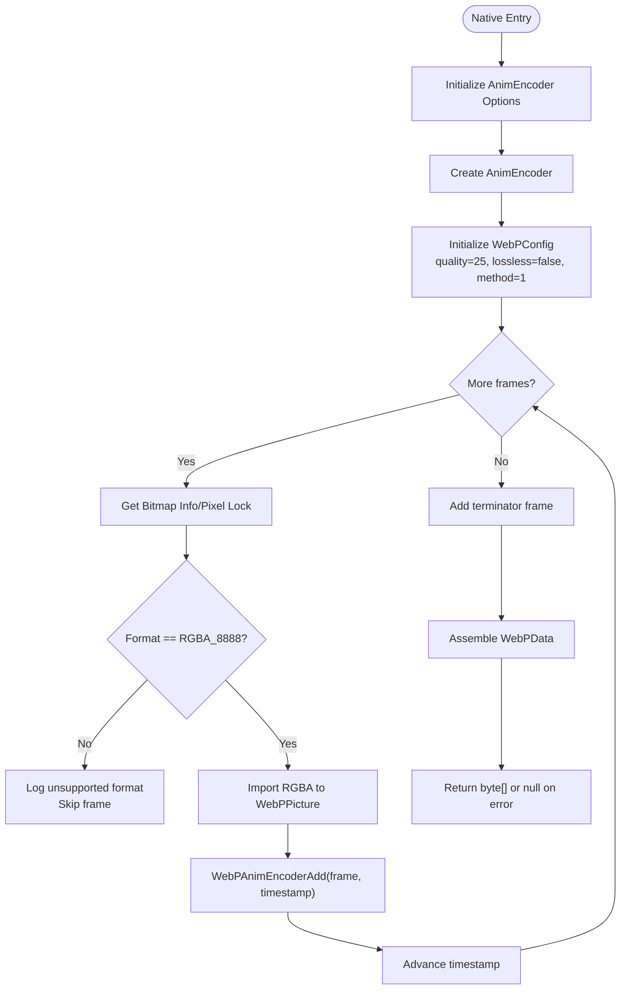
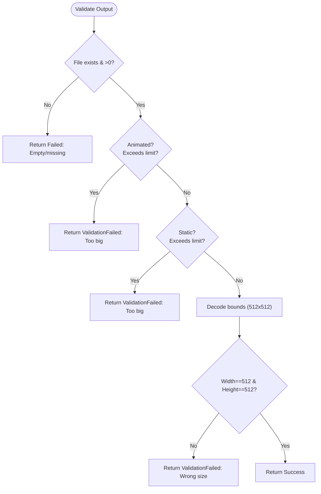
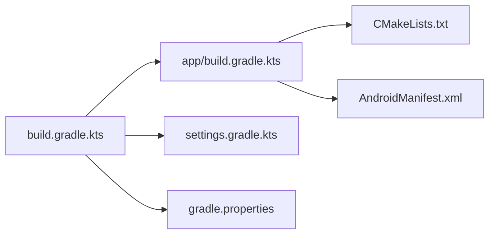

# Troubleshooting and FAQ

<cite>
**Referenced Files in This Document**
- [README.md](file://README.md)
- [CHANGELOG.md](file://CHANGELOG.md)
- [build.gradle.kts](file://build.gradle.kts)
- [app/build.gradle.kts](file://app/build.gradle.kts)
- [settings.gradle.kts](file://settings.gradle.kts)
- [gradle.properties](file://gradle.properties)
- [CMakeLists.txt](file://app/src/main/cpp/CMakeLists.txt)
- [webp_native_bridge.cpp](file://app/src/main/cpp/webp_native_bridge.cpp)
- [animated_pipe.md](file://assets/docs/animated_pipe.md)
- [StickerConverter.kt](file://app/src/main/java/com/maheshsharan/tel2what/engine/StickerConverter.kt)
- [WhatsAppStickerValidator.kt](file://app/src/main/java/com/maheshsharan/tel2what/engine/WhatsAppStickerValidator.kt)
- [ImageProcessor.kt](file://app/src/main/java/com/maheshsharan/tel2what/utils/ImageProcessor.kt)
- [AndroidManifest.xml](file://app/src/main/AndroidManifest.xml)
</cite>

## Table of Contents
1. [Introduction](#introduction)
2. [Project Structure](#project-structure)
3. [Core Components](#core-components)
4. [Architecture Overview](#architecture-overview)
5. [Detailed Component Analysis](#detailed-component-analysis)
6. [Dependency Analysis](#dependency-analysis)
7. [Performance Considerations](#performance-considerations)
8. [Troubleshooting Guide](#troubleshooting-guide)
9. [FAQ](#faq)
10. [Conclusion](#conclusion)

## Introduction
This document provides a comprehensive troubleshooting and FAQ guide for Tel2What, focusing on build issues, runtime errors, debugging native code and JNI, performance bottlenecks, and platform-specific problems. It also covers Telegram bot integration, sticker format compatibility, export limitations, diagnostics, and profiling.

## Project Structure
Tel2What is an Android application written in Kotlin with a native C++ WebP encoder powered by libwebp and CMake. The build integrates:
- Android Gradle Plugin and Kotlin DSL
- CMake for native compilation
- libwebp embedded under app/src/main/cpp/libwebp
- Kotlin Coroutines, Room, Navigation, and networking libraries

**Diagram sources**
- [app/build.gradle.kts](file://app/build.gradle.kts#L1-L117)
- [CMakeLists.txt](file://app/src/main/cpp/CMakeLists.txt#L1-L44)
- [webp_native_bridge.cpp](file://app/src/main/cpp/webp_native_bridge.cpp#L1-L148)
- [StickerConverter.kt](file://app/src/main/java/com/maheshsharan/tel2what/engine/StickerConverter.kt#L1-L20)
- [WhatsAppStickerValidator.kt](file://app/src/main/java/com/maheshsharan/tel2what/engine/WhatsAppStickerValidator.kt#L1-L72)
- [ImageProcessor.kt](file://app/src/main/java/com/maheshsharan/tel2what/utils/ImageProcessor.kt#L1-L68)
- [AndroidManifest.xml](file://app/src/main/AndroidManifest.xml#L1-L39)
- [animated_pipe.md](file://assets/docs/animated_pipe.md#L1-L252)
- [README.md](file://README.md#L1-L174)

**Section sources**
- [README.md](file://README.md#L87-L120)
- [app/build.gradle.kts](file://app/build.gradle.kts#L16-L81)
- [CMakeLists.txt](file://app/src/main/cpp/CMakeLists.txt#L1-L44)
- [animated_pipe.md](file://assets/docs/animated_pipe.md#L1-L252)

## Core Components
- StickerConverter interface defines the contract for converting Telegram stickers to WhatsApp-compliant WebP.
- WhatsAppStickerValidator enforces size, dimension, and format constraints before export.
- ImageProcessor handles tray icon generation with size and dimension checks.
- Native WebP encoder uses JNI to encode animated WebP from Android Bitmap arrays.

**Section sources**
- [StickerConverter.kt](file://app/src/main/java/com/maheshsharan/tel2what/engine/StickerConverter.kt#L1-L20)
- [WhatsAppStickerValidator.kt](file://app/src/main/java/com/maheshsharan/tel2what/engine/WhatsAppStickerValidator.kt#L1-L72)
- [ImageProcessor.kt](file://app/src/main/java/com/maheshsharan/tel2what/utils/ImageProcessor.kt#L1-L68)
- [webp_native_bridge.cpp](file://app/src/main/cpp/webp_native_bridge.cpp#L1-L148)

## Architecture Overview
The conversion pipeline decodes TGS/WebM to frames, normalizes and adjusts timing, then encodes to animated WebP using a native JNI bridge backed by libwebp. Validation ensures compliance with WhatsApp constraints.

**Diagram sources**
- [StickerConverter.kt](file://app/src/main/java/com/maheshsharan/tel2what/engine/StickerConverter.kt#L1-L20)
- [animated_pipe.md](file://assets/docs/animated_pipe.md#L27-L90)
- [webp_native_bridge.cpp](file://app/src/main/cpp/webp_native_bridge.cpp#L13-L148)
- [WhatsAppStickerValidator.kt](file://app/src/main/java/com/maheshsharan/tel2what/engine/WhatsAppStickerValidator.kt#L14-L70)

## Detailed Component Analysis

### Native WebP Encoder (JNI)
- JNI method signature imports frames as Android Bitmap arrays and durations as integers.
- Requires RGBA_8888 frames; unsupported formats are logged and skipped.
- Uses WebPAnimEncoder with lossy quality and method tuned for speed.
- Logs errors and returns null on initialization or encoding failures.
- Outputs a byte[] containing the animated WebP data.

**Diagram sources**
- [webp_native_bridge.cpp](file://app/src/main/cpp/webp_native_bridge.cpp#L13-L148)

**Section sources**
- [webp_native_bridge.cpp](file://app/src/main/cpp/webp_native_bridge.cpp#L13-L148)
- [animated_pipe.md](file://assets/docs/animated_pipe.md#L70-L90)

### Validation Pipeline
- Validates file existence and size against configured limits.
- Reads dimensions via BitmapFactory bounds to check exact 512x512.
- Returns appropriate result type for UI handling.

**Diagram sources**
- [WhatsAppStickerValidator.kt](file://app/src/main/java/com/maheshsharan/tel2what/engine/WhatsAppStickerValidator.kt#L14-L70)

**Section sources**
- [WhatsAppStickerValidator.kt](file://app/src/main/java/com/maheshsharan/tel2what/engine/WhatsAppStickerValidator.kt#L14-L70)

### Tray Icon Processor
- Resizes to 96x96 and compresses iteratively to stay under 50 KB.
- Uses WEBP_LOSSY on supported platforms.

**Section sources**
- [ImageProcessor.kt](file://app/src/main/java/com/maheshsharan/tel2what/utils/ImageProcessor.kt#L14-L66)

## Dependency Analysis
- Build plugins and versions are declared at the root level; app module configures compile/target SDK, ABI filters, and external native build via CMake.
- Gradle JVM args and configuration cache settings are tuned for native builds.
- Manifest declares internet permissions and queries WhatsApp packages.

**Diagram sources**
- [build.gradle.kts](file://build.gradle.kts#L1-L5)
- [app/build.gradle.kts](file://app/build.gradle.kts#L1-L117)
- [settings.gradle.kts](file://settings.gradle.kts#L1-L26)
- [gradle.properties](file://gradle.properties#L1-L12)
- [AndroidManifest.xml](file://app/src/main/AndroidManifest.xml#L1-L39)

**Section sources**
- [build.gradle.kts](file://build.gradle.kts#L1-L5)
- [app/build.gradle.kts](file://app/build.gradle.kts#L16-L81)
- [settings.gradle.kts](file://settings.gradle.kts#L1-L26)
- [gradle.properties](file://gradle.properties#L1-L12)
- [AndroidManifest.xml](file://app/src/main/AndroidManifest.xml#L1-L39)

## Performance Considerations
- Native encoding is optimized with method=1 and quality=25 for speed.
- Animated conversions are single-threaded to avoid OOM and thermal throttling.
- Static conversions use a semaphore to limit parallelism.
- Color space conversion avoids Surface/ImageReader pitfalls by using ByteBuffer/YUV path.

**Section sources**
- [animated_pipe.md](file://assets/docs/animated_pipe.md#L114-L126)
- [animated_pipe.md](file://assets/docs/animated_pipe.md#L144-L163)
- [webp_native_bridge.cpp](file://app/src/main/cpp/webp_native_bridge.cpp#L78-L108)

## Troubleshooting Guide

### Build Issues

- NDK and CMake Version Mismatch
  - Symptom: CMake fails to configure or link native libraries.
  - Cause: External native build version set to a specific CMake version while toolchain/NDK does not match.
  - Resolution: Align Android Studio NDK and CMake versions with the project’s expectations and ensure the NDK is installed in Android Studio SDK Manager.

  **Section sources**
  - [app/build.gradle.kts](file://app/build.gradle.kts#L60-L65)
  - [CMakeLists.txt](file://app/src/main/cpp/CMakeLists.txt#L1-L44)

- ABI Filters and APK Size
  - Symptom: Unexpectedly large APK or missing native binaries for certain ABIs.
  - Cause: ABI filters restrict architectures to arm64-v8a and armeabi-v7a.
  - Resolution: Verify device ABI and update filters if targeting other architectures.

  **Section sources**
  - [app/build.gradle.kts](file://app/build.gradle.kts#L32-L40)

- Gradle Sync Failures
  - Symptom: Sync fails due to repository or plugin resolution errors.
  - Cause: Repositories configuration or plugin versions.
  - Resolution: Ensure Google and Maven Central are reachable; confirm plugin versions in root build script.

  **Section sources**
  - [settings.gradle.kts](file://settings.gradle.kts#L8-L22)
  - [build.gradle.kts](file://build.gradle.kts#L1-L5)

- Out of Memory During Native Builds
  - Symptom: Gradle OOM during CMake/native tasks.
  - Cause: Insufficient heap for native compilation.
  - Resolution: Increase Gradle JVM args as configured; disable configuration cache if needed.

  **Section sources**
  - [gradle.properties](file://gradle.properties#L9-L11)

- Telegram Bot Token Not Applied
  - Symptom: Network requests fail or rate-limited.
  - Cause: Missing or invalid TELEGRAM_BOT_TOKEN in local properties.
  - Resolution: Set TELEGRAM_BOT_TOKEN in local.properties and rebuild.

  **Section sources**
  - [app/build.gradle.kts](file://app/build.gradle.kts#L10-L31)
  - [README.md](file://README.md#L121-L133)

### Runtime Errors

- Conversion Failures
  - Symptom: Conversion returns Failed or ValidationFailed.
  - Causes:
    - Empty or missing output file
    - Exceeded size limits
    - Incorrect dimensions (must be exactly 512x512)
  - Resolution: Re-run conversion; verify input format; reduce complexity or frame count.

  **Section sources**
  - [WhatsAppStickerValidator.kt](file://app/src/main/java/com/maheshsharan/tel2what/engine/WhatsAppStickerValidator.kt#L19-L56)

- Memory Issues (OOM)
  - Symptom: Crashes during animated conversion or large batches.
  - Causes: Animated conversions are single-threaded; static conversions limited by semaphore; insufficient memory for large frames.
  - Resolution: Reduce batch size; ensure device has sufficient RAM; monitor memory usage.

  **Section sources**
  - [animated_pipe.md](file://assets/docs/animated_pipe.md#L114-L126)

- Validation Problems
  - Symptom: Validator reports dimension or size violations.
  - Resolution: Recreate frames with normalized dimensions; ensure quality/fps adjustments succeeded.

  **Section sources**
  - [WhatsAppStickerValidator.kt](file://app/src/main/java/com/maheshsharan/tel2what/engine/WhatsAppStickerValidator.kt#L25-L56)

- Export Limitations
  - Symptom: Cannot export to WhatsApp or app rejects sticker.
  - Causes: Non-compliant size/dimensions or unsupported format.
  - Resolution: Confirm output passes validator; ensure animated WebP with infinite loop.

  **Section sources**
  - [WhatsAppStickerValidator.kt](file://app/src/main/java/com/maheshsharan/tel2what/engine/WhatsAppStickerValidator.kt#L14-L70)

### Debugging Guidance

- Native Code and JNI Issues
  - Enable verbose logging in native code and check Logcat for “Tel2What:NativeWebp” entries.
  - Verify RGBA_8888 frames and successful pixel locks.
  - Validate WebPAnimEncoder options and assembly steps.

  **Section sources**
  - [webp_native_bridge.cpp](file://app/src/main/cpp/webp_native_bridge.cpp#L9-L148)

- Performance Bottlenecks
  - Monitor conversion stages: WebM frame extraction, TGS rendering, and native WebP encoding.
  - Use device profiling tools to identify hotspots; consider adaptive quality/fps adjustments.

  **Section sources**
  - [animated_pipe.md](file://assets/docs/animated_pipe.md#L144-L163)

- Diagnostics and Logs
  - Use Android Studio Logcat to capture logs from validator and native bridge.
  - Capture file sizes and dimensions reported by validator.

  **Section sources**
  - [WhatsAppStickerValidator.kt](file://app/src/main/java/com/maheshsharan/tel2what/engine/WhatsAppStickerValidator.kt#L14-L70)
  - [webp_native_bridge.cpp](file://app/src/main/cpp/webp_native_bridge.cpp#L25-L133)

- Platform-Specific Problems
  - Manifest queries for WhatsApp packages must be present for export.
  - Ensure INTERNET permission is granted for network operations.

  **Section sources**
  - [AndroidManifest.xml](file://app/src/main/AndroidManifest.xml#L3-L9)
  - [AndroidManifest.xml](file://app/src/main/AndroidManifest.xml#L26-L35)

## FAQ

- How do I integrate my own Telegram bot?
  - Create a bot via BotFather and replace the token in the build configuration. The app reads the token from local properties and injects it into BuildConfig.

  **Section sources**
  - [README.md](file://README.md#L121-L133)
  - [app/build.gradle.kts](file://app/build.gradle.kts#L10-L31)

- What sticker formats are supported?
  - TGS (Lottie) and WebM animated stickers are supported; static images are converted to WebP.

  **Section sources**
  - [animated_pipe.md](file://assets/docs/animated_pipe.md#L13-L26)
  - [README.md](file://README.md#L24-L30)

- Why does animated conversion take time?
  - Native WebP encoding is optimized for speed (~2–3s per sticker) with method=1 and quality=25. Larger frame counts or higher FPS increase processing time.

  **Section sources**
  - [animated_pipe.md](file://assets/docs/animated_pipe.md#L144-L163)
  - [webp_native_bridge.cpp](file://app/src/main/cpp/webp_native_bridge.cpp#L78-L84)

- What are the export limitations?
  - Animated WebP must be exactly 512x512, under 500KB, and loop infinitely. Static WebP must meet size and dimension requirements.

  **Section sources**
  - [animated_pipe.md](file://assets/docs/animated_pipe.md#L18-L26)
  - [WhatsAppStickerValidator.kt](file://app/src/main/java/com/maheshsharan/tel2what/engine/WhatsAppStickerValidator.kt#L25-L56)

- How do I troubleshoot conversion failures?
  - Check validator logs for empty/missing files, size violations, or dimension mismatches. Verify input format and reduce complexity if needed.

  **Section sources**
  - [WhatsAppStickerValidator.kt](file://app/src/main/java/com/maheshsharan/tel2what/engine/WhatsAppStickerValidator.kt#L19-L56)

- How do I handle memory issues during conversion?
  - Animated conversions are single-threaded; static conversions are limited by a semaphore. Reduce batch size and ensure proper bitmap recycling.

  **Section sources**
  - [animated_pipe.md](file://assets/docs/animated_pipe.md#L114-L126)

- How do I diagnose native encoding problems?
  - Look for “Tel2What:NativeWebp” logs; verify RGBA_8888 frames, successful pixel locks, and WebP assembly completion.

  **Section sources**
  - [webp_native_bridge.cpp](file://app/src/main/cpp/webp_native_bridge.cpp#L25-L133)

- How do I profile performance?
  - Use Android Studio profiler to track CPU, memory, and GPU usage during conversion. Focus on WebM extraction and native encoding stages.

  **Section sources**
  - [animated_pipe.md](file://assets/docs/animated_pipe.md#L144-L163)

## Conclusion
This guide consolidates common build and runtime issues, debugging strategies, and FAQs for Tel2What. By aligning build configurations, validating outputs, and leveraging native logging and profiling tools, most problems can be resolved efficiently. For persistent issues, consult the referenced files and logs for precise failure points.