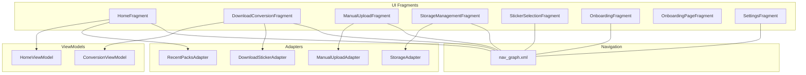
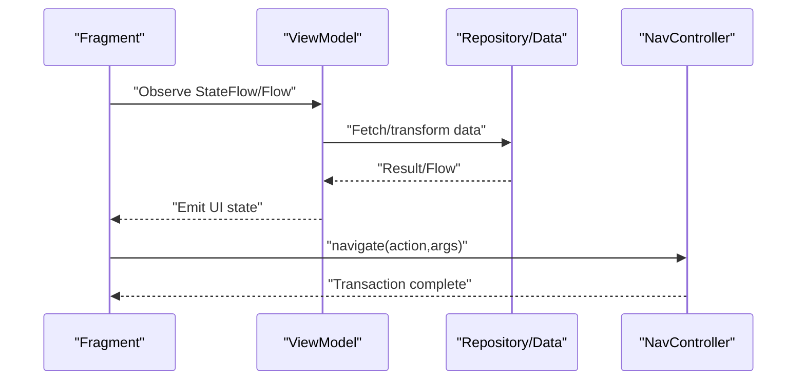
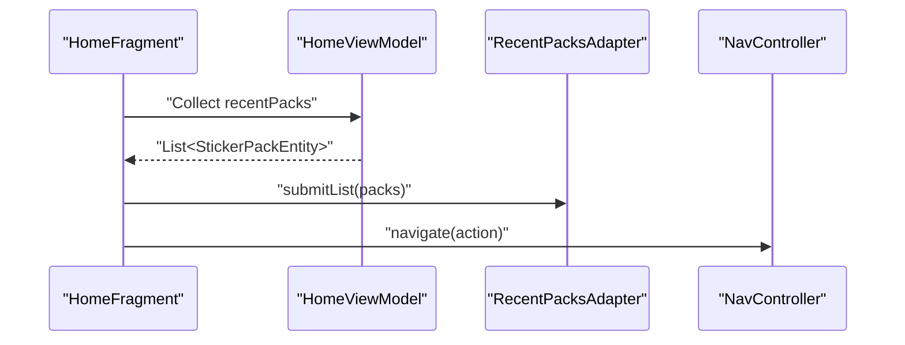
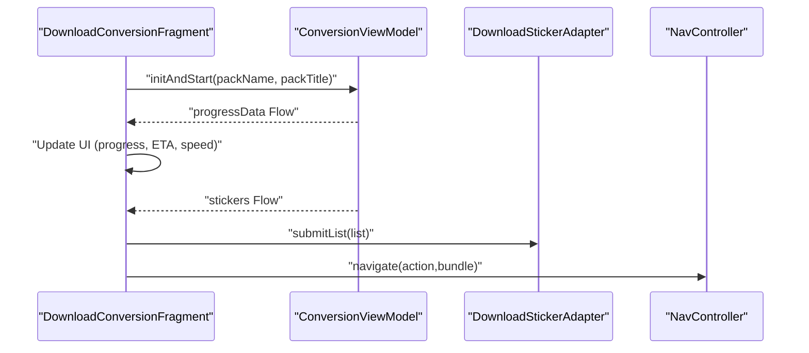
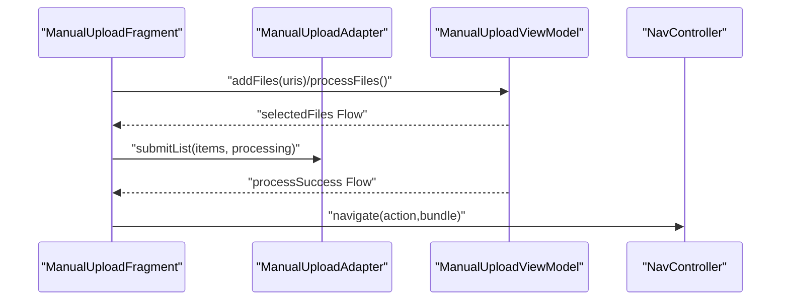
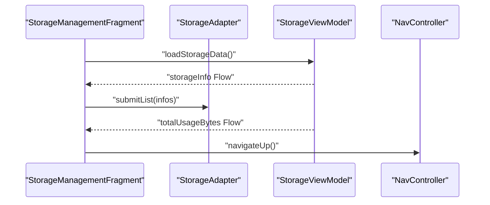
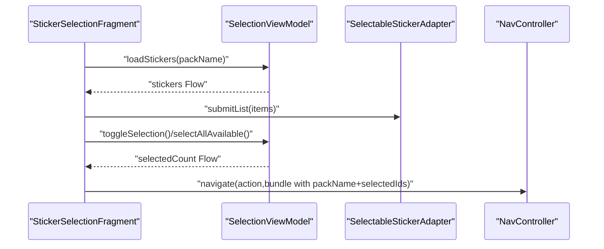
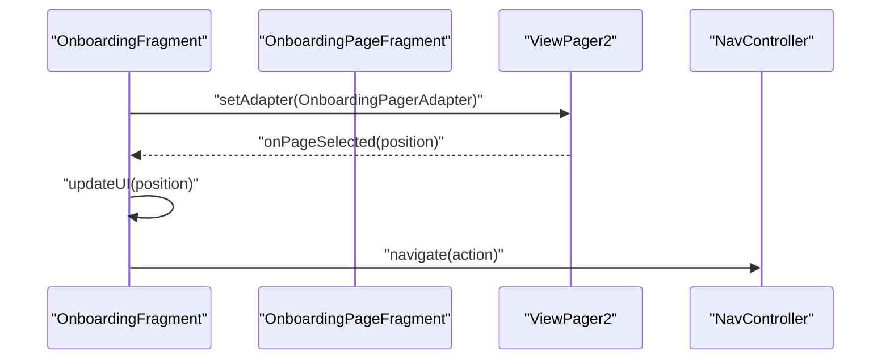
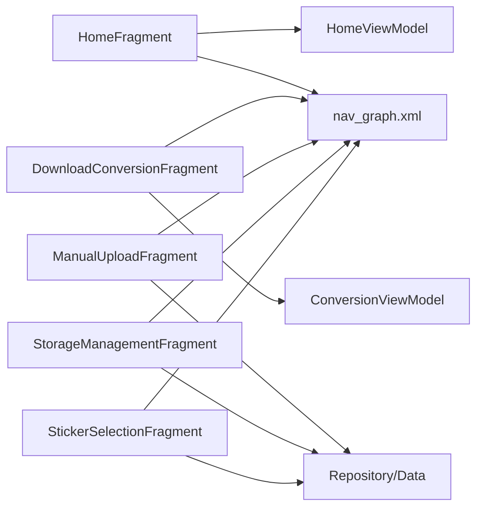

# Fragment Components

<cite>
**Referenced Files in This Document**
- [HomeFragment.kt](file://app/src/main/java/com/maheshsharan/tel2what/ui/home/HomeFragment.kt)
- [HomeViewModel.kt](file://app/src/main/java/com/maheshsharan/tel2what/ui/home/HomeViewModel.kt)
- [RecentPacksAdapter.kt](file://app/src/main/java/com/maheshsharan/tel2what/ui/home/RecentPacksAdapter.kt)
- [DownloadConversionFragment.kt](file://app/src/main/java/com/maheshsharan/tel2what/ui/conversion/DownloadConversionFragment.kt)
- [ConversionViewModel.kt](file://app/src/main/java/com/maheshsharan/tel2what/ui/conversion/ConversionViewModel.kt)
- [DownloadStickerAdapter.kt](file://app/src/main/java/com/maheshsharan/tel2what/ui/conversion/DownloadStickerAdapter.kt)
- [ManualUploadFragment.kt](file://app/src/main/java/com/maheshsharan/tel2what/ui/manual/ManualUploadFragment.kt)
- [ManualUploadAdapter.kt](file://app/src/main/java/com/maheshsharan/tel2what/ui/manual/ManualUploadAdapter.kt)
- [StorageManagementFragment.kt](file://app/src/main/java/com/maheshsharan/tel2what/ui/storage/StorageManagementFragment.kt)
- [StorageAdapter.kt](file://app/src/main/java/com/maheshsharan/tel2what/ui/storage/StorageAdapter.kt)
- [StickerSelectionFragment.kt](file://app/src/main/java/com/maheshsharan/tel2what/ui/selection/StickerSelectionFragment.kt)
- [OnboardingFragment.kt](file://app/src/main/java/com/maheshsharan/tel2what/ui/onboarding/OnboardingFragment.kt)
- [OnboardingPageFragment.kt](file://app/src/main/java/com/maheshsharan/tel2what/ui/onboarding/OnboardingPageFragment.kt)
- [SettingsFragment.kt](file://app/src/main/java/com/maheshsharan/tel2what/ui/settings/SettingsFragment.kt)
- [nav_graph.xml](file://app/src/main/res/navigation/nav_graph.xml)
</cite>

## Table of Contents
1. [Introduction](#introduction)
2. [Project Structure](#project-structure)
3. [Core Components](#core-components)
4. [Architecture Overview](#architecture-overview)
5. [Detailed Component Analysis](#detailed-component-analysis)
6. [Dependency Analysis](#dependency-analysis)
7. [Performance Considerations](#performance-considerations)
8. [Troubleshooting Guide](#troubleshooting-guide)
9. [Conclusion](#conclusion)

## Introduction
This document explains the fragment components and implementation patterns used in the Tel2What application. It covers lifecycle management, view binding, state observation, UI patterns (RecyclerView adapters, forms, progress indicators), fragment-to-fragment communication (arguments, navigation actions, ViewModel sharing), transaction and navigation management, accessibility and input handling, composition and reuse strategies, and performance/memory optimization.

## Project Structure
The fragments are organized by feature under the ui package, each backed by a ViewModel and supporting adapters. Navigation is centralized via a single navigation graph.

**Diagram sources**
- [HomeFragment.kt](file://app/src/main/java/com/maheshsharan/tel2what/ui/home/HomeFragment.kt#L21-L106)
- [DownloadConversionFragment.kt](file://app/src/main/java/com/maheshsharan/tel2what/ui/conversion/DownloadConversionFragment.kt#L21-L137)
- [ManualUploadFragment.kt](file://app/src/main/java/com/maheshsharan/tel2what/ui/manual/ManualUploadFragment.kt#L23-L111)
- [StorageManagementFragment.kt](file://app/src/main/java/com/maheshsharan/tel2what/ui/storage/StorageManagementFragment.kt#L22-L118)
- [StickerSelectionFragment.kt](file://app/src/main/java/com/maheshsharan/tel2what/ui/selection/StickerSelectionFragment.kt#L22-L93)
- [OnboardingFragment.kt](file://app/src/main/java/com/maheshsharan/tel2what/ui/onboarding/OnboardingFragment.kt#L12-L69)
- [OnboardingPageFragment.kt](file://app/src/main/java/com/maheshsharan/tel2what/ui/onboarding/OnboardingPageFragment.kt#L10-L52)
- [SettingsFragment.kt](file://app/src/main/java/com/maheshsharan/tel2what/ui/settings/SettingsFragment.kt#L15-L60)
- [HomeViewModel.kt](file://app/src/main/java/com/maheshsharan/tel2what/ui/home/HomeViewModel.kt#L19-L47)
- [ConversionViewModel.kt](file://app/src/main/java/com/maheshsharan/tel2what/ui/conversion/ConversionViewModel.kt#L39-L453)
- [RecentPacksAdapter.kt](file://app/src/main/java/com/maheshsharan/tel2what/ui/home/RecentPacksAdapter.kt#L13-L63)
- [DownloadStickerAdapter.kt](file://app/src/main/java/com/maheshsharan/tel2what/ui/conversion/DownloadStickerAdapter.kt#L16-L85)
- [ManualUploadAdapter.kt](file://app/src/main/java/com/maheshsharan/tel2what/ui/manual/ManualUploadAdapter.kt#L13-L83)
- [StorageAdapter.kt](file://app/src/main/java/com/maheshsharan/tel2what/ui/storage/StorageAdapter.kt#L13-L69)
- [nav_graph.xml](file://app/src/main/res/navigation/nav_graph.xml)

**Section sources**
- [HomeFragment.kt](file://app/src/main/java/com/maheshsharan/tel2what/ui/home/HomeFragment.kt#L21-L106)
- [DownloadConversionFragment.kt](file://app/src/main/java/com/maheshsharan/tel2what/ui/conversion/DownloadConversionFragment.kt#L21-L137)
- [ManualUploadFragment.kt](file://app/src/main/java/com/maheshsharan/tel2what/ui/manual/ManualUploadFragment.kt#L23-L111)
- [StorageManagementFragment.kt](file://app/src/main/java/com/maheshsharan/tel2what/ui/storage/StorageManagementFragment.kt#L22-L118)
- [StickerSelectionFragment.kt](file://app/src/main/java/com/maheshsharan/tel2what/ui/selection/StickerSelectionFragment.kt#L22-L93)
- [OnboardingFragment.kt](file://app/src/main/java/com/maheshsharan/tel2what/ui/onboarding/OnboardingFragment.kt#L12-L69)
- [OnboardingPageFragment.kt](file://app/src/main/java/com/maheshsharan/tel2what/ui/onboarding/OnboardingPageFragment.kt#L10-L52)
- [SettingsFragment.kt](file://app/src/main/java/com/maheshsharan/tel2what/ui/settings/SettingsFragment.kt#L15-L60)
- [nav_graph.xml](file://app/src/main/res/navigation/nav_graph.xml)

## Core Components
- HomeFragment: Entry point displaying recent packs, navigation to import/manual/storage, and bottom navigation.
- DownloadConversionFragment: Downloads and converts Telegram sticker packs with progress UI and batch controls.
- ManualUploadFragment: Allows selecting images, processing them, and navigating to selection/export.
- StorageManagementFragment: Lists packs, clears caches, deletes packs, and shows total usage.
- StickerSelectionFragment: Selects stickers (3–30), passes selection to next step.
- OnboardingFragment and OnboardingPageFragment: Onboarding with ViewPager2 pages and completion logic.
- SettingsFragment: Application settings and external links.

Each fragment follows a consistent pattern:
- Inflate layout in constructor.
- Initialize ViewModel via Factory.
- Bind views and set click listeners.
- Observe StateFlow/Flow with lifecycle-aware scopes.
- Navigate using safe args and actions from nav_graph.xml.
- Clean up references in onDestroyView to prevent leaks.

**Section sources**
- [HomeFragment.kt](file://app/src/main/java/com/maheshsharan/tel2what/ui/home/HomeFragment.kt#L21-L106)
- [DownloadConversionFragment.kt](file://app/src/main/java/com/maheshsharan/tel2what/ui/conversion/DownloadConversionFragment.kt#L21-L137)
- [ManualUploadFragment.kt](file://app/src/main/java/com/maheshsharan/tel2what/ui/manual/ManualUploadFragment.kt#L23-L111)
- [StorageManagementFragment.kt](file://app/src/main/java/com/maheshsharan/tel2what/ui/storage/StorageManagementFragment.kt#L22-L118)
- [StickerSelectionFragment.kt](file://app/src/main/java/com/maheshsharan/tel2what/ui/selection/StickerSelectionFragment.kt#L22-L93)
- [OnboardingFragment.kt](file://app/src/main/java/com/maheshsharan/tel2what/ui/onboarding/OnboardingFragment.kt#L12-L69)
- [OnboardingPageFragment.kt](file://app/src/main/java/com/maheshsharan/tel2what/ui/onboarding/OnboardingPageFragment.kt#L10-L52)
- [SettingsFragment.kt](file://app/src/main/java/com/maheshsharan/tel2what/ui/settings/SettingsFragment.kt#L15-L60)

## Architecture Overview
The fragments observe reactive streams from ViewModels and drive UI updates. Navigation actions connect fragments declaratively. Adapters encapsulate RecyclerView rendering and event callbacks.

**Diagram sources**
- [HomeFragment.kt](file://app/src/main/java/com/maheshsharan/tel2what/ui/home/HomeFragment.kt#L26-L98)
- [DownloadConversionFragment.kt](file://app/src/main/java/com/maheshsharan/tel2what/ui/conversion/DownloadConversionFragment.kt#L60-L122)
- [ManualUploadFragment.kt](file://app/src/main/java/com/maheshsharan/tel2what/ui/manual/ManualUploadFragment.kt#L54-L109)
- [StorageManagementFragment.kt](file://app/src/main/java/com/maheshsharan/tel2what/ui/storage/StorageManagementFragment.kt#L62-L107)
- [StickerSelectionFragment.kt](file://app/src/main/java/com/maheshsharan/tel2what/ui/selection/StickerSelectionFragment.kt#L53-L91)
- [HomeViewModel.kt](file://app/src/main/java/com/maheshsharan/tel2what/ui/home/HomeViewModel.kt#L21-L35)
- [ConversionViewModel.kt](file://app/src/main/java/com/maheshsharan/tel2what/ui/conversion/ConversionViewModel.kt#L48-L138)
- [nav_graph.xml](file://app/src/main/res/navigation/nav_graph.xml)

## Detailed Component Analysis

### HomeFragment
- Lifecycle: onViewCreated initializes ViewModel, binds views, sets up RecyclerView with RecentPacksAdapter, observes flows, and wires bottom navigation and cards to navigate to other fragments.
- View binding: Uses findViewById for MaterialCardView, RecyclerView, and BottomNavigationView.
- State observation: Collects recentPacks and uiState; shows error Toast on HomeUiState.Error.
- Memory cleanup: Clears adapter reference in onDestroyView.

**Diagram sources**
- [HomeFragment.kt](file://app/src/main/java/com/maheshsharan/tel2what/ui/home/HomeFragment.kt#L26-L98)
- [HomeViewModel.kt](file://app/src/main/java/com/maheshsharan/tel2what/ui/home/HomeViewModel.kt#L21-L35)
- [RecentPacksAdapter.kt](file://app/src/main/java/com/maheshsharan/tel2what/ui/home/RecentPacksAdapter.kt#L18-L31)

**Section sources**
- [HomeFragment.kt](file://app/src/main/java/com/maheshsharan/tel2what/ui/home/HomeFragment.kt#L21-L106)
- [HomeViewModel.kt](file://app/src/main/java/com/maheshsharan/tel2what/ui/home/HomeViewModel.kt#L19-L47)
- [RecentPacksAdapter.kt](file://app/src/main/java/com/maheshsharan/tel2what/ui/home/RecentPacksAdapter.kt#L13-L63)

### DownloadConversionFragment
- Lifecycle: onViewCreated initializes ViewModel, binds views, reads arguments (packName, packTitle), starts conversion, observes progress and sticker lists, and wires buttons.
- Arguments: Receives packName and packTitle from previous fragment.
- Progress UI: Updates ProgressBar, percentage, ETA/speed, and overall progress; enables/disables Stop/Continue/Download More based on state.
- Adapter: DownloadStickerAdapter renders per-sticker status and images.

**Diagram sources**
- [DownloadConversionFragment.kt](file://app/src/main/java/com/maheshsharan/tel2what/ui/conversion/DownloadConversionFragment.kt#L26-L122)
- [ConversionViewModel.kt](file://app/src/main/java/com/maheshsharan/tel2what/ui/conversion/ConversionViewModel.kt#L66-L138)
- [DownloadStickerAdapter.kt](file://app/src/main/java/com/maheshsharan/tel2what/ui/conversion/DownloadStickerAdapter.kt#L20-L82)

**Section sources**
- [DownloadConversionFragment.kt](file://app/src/main/java/com/maheshsharan/tel2what/ui/conversion/DownloadConversionFragment.kt#L21-L137)
- [ConversionViewModel.kt](file://app/src/main/java/com/maheshsharan/tel2what/ui/conversion/ConversionViewModel.kt#L39-L453)
- [DownloadStickerAdapter.kt](file://app/src/main/java/com/maheshsharan/tel2what/ui/conversion/DownloadStickerAdapter.kt#L16-L85)

### ManualUploadFragment
- Lifecycle: onViewCreated initializes ViewModel, registers ActivityResult launcher, sets up ManualUploadAdapter, observes selectedFiles and isProcessing, and handles process success.
- Form handling: Validates selection count (3–30), disables UI during processing, and navigates on success.
- Adapter: ManualUploadAdapter shows per-item status and remove button.

**Diagram sources**
- [ManualUploadFragment.kt](file://app/src/main/java/com/maheshsharan/tel2what/ui/manual/ManualUploadFragment.kt#L34-L109)
- [ManualUploadAdapter.kt](file://app/src/main/java/com/maheshsharan/tel2what/ui/manual/ManualUploadAdapter.kt#L20-L80)

**Section sources**
- [ManualUploadFragment.kt](file://app/src/main/java/com/maheshsharan/tel2what/ui/manual/ManualUploadFragment.kt#L23-L111)
- [ManualUploadAdapter.kt](file://app/src/main/java/com/maheshsharan/tel2what/ui/manual/ManualUploadAdapter.kt#L13-L83)

### StorageManagementFragment
- Lifecycle: onViewCreated initializes ViewModel, sets up StorageAdapter, observes storageInfo and totalUsageBytes, and wires back/clear/delete actions.
- Dialogs: Confirmation dialogs for cache and deletion.
- Adapter: StorageAdapter shows tray preview, details, and action buttons.

**Diagram sources**
- [StorageManagementFragment.kt](file://app/src/main/java/com/maheshsharan/tel2what/ui/storage/StorageManagementFragment.kt#L27-L107)
- [StorageAdapter.kt](file://app/src/main/java/com/maheshsharan/tel2what/ui/storage/StorageAdapter.kt#L20-L66)

**Section sources**
- [StorageManagementFragment.kt](file://app/src/main/java/com/maheshsharan/tel2what/ui/storage/StorageManagementFragment.kt#L22-L118)
- [StorageAdapter.kt](file://app/src/main/java/com/maheshsharan/tel2what/ui/storage/StorageAdapter.kt#L13-L69)

### StickerSelectionFragment
- Lifecycle: onViewCreated initializes ViewModel, sets up SelectableStickerAdapter, loads stickers by packName from arguments, observes selectedCount, and navigates with selectedIds.
- Validation: Ensures selection count is within 3–30 before continuing.

**Diagram sources**
- [StickerSelectionFragment.kt](file://app/src/main/java/com/maheshsharan/tel2what/ui/selection/StickerSelectionFragment.kt#L31-L91)

**Section sources**
- [StickerSelectionFragment.kt](file://app/src/main/java/com/maheshsharan/tel2what/ui/selection/StickerSelectionFragment.kt#L22-L93)

### OnboardingFragment and OnboardingPageFragment
- Composition: OnboardingFragment hosts ViewPager2 with OnboardingPageFragment pages.
- Communication: OnboardingFragment updates UI based on page position and completes onboarding by writing a preference and navigating to Home.

**Diagram sources**
- [OnboardingFragment.kt](file://app/src/main/java/com/maheshsharan/tel2what/ui/onboarding/OnboardingFragment.kt#L18-L67)
- [OnboardingPageFragment.kt](file://app/src/main/java/com/maheshsharan/tel2what/ui/onboarding/OnboardingPageFragment.kt#L24-L50)

**Section sources**
- [OnboardingFragment.kt](file://app/src/main/java/com/maheshsharan/tel2what/ui/onboarding/OnboardingFragment.kt#L12-L69)
- [OnboardingPageFragment.kt](file://app/src/main/java/com/maheshsharan/tel2what/ui/onboarding/OnboardingPageFragment.kt#L10-L52)

### SettingsFragment
- Navigation: Provides quick links to external resources and returns via navigateUp.

**Section sources**
- [SettingsFragment.kt](file://app/src/main/java/com/maheshsharan/tel2what/ui/settings/SettingsFragment.kt#L15-L60)

## Dependency Analysis
- Fragment-to-ViewModel: Each fragment constructs a ViewModel via a Factory using repository instances.
- Fragment-to-Fragment: Navigation actions defined in nav_graph.xml connect fragments; arguments are passed via Bundle.
- Adapter-to-Model: Adapters receive data lists and expose callbacks to fragments for user actions.
- External dependencies: Glide for image loading, NavController for navigation, and repository/data sources for domain logic.

**Diagram sources**
- [HomeFragment.kt](file://app/src/main/java/com/maheshsharan/tel2what/ui/home/HomeFragment.kt#L29-L33)
- [DownloadConversionFragment.kt](file://app/src/main/java/com/maheshsharan/tel2what/ui/conversion/DownloadConversionFragment.kt#L29-L33)
- [ManualUploadFragment.kt](file://app/src/main/java/com/maheshsharan/tel2what/ui/manual/ManualUploadFragment.kt#L37-L40)
- [StorageManagementFragment.kt](file://app/src/main/java/com/maheshsharan/tel2what/ui/storage/StorageManagementFragment.kt#L30-L33)
- [StickerSelectionFragment.kt](file://app/src/main/java/com/maheshsharan/tel2what/ui/selection/StickerSelectionFragment.kt#L34-L37)
- [nav_graph.xml](file://app/src/main/res/navigation/nav_graph.xml)

**Section sources**
- [HomeFragment.kt](file://app/src/main/java/com/maheshsharan/tel2what/ui/home/HomeFragment.kt#L29-L33)
- [DownloadConversionFragment.kt](file://app/src/main/java/com/maheshsharan/tel2what/ui/conversion/DownloadConversionFragment.kt#L29-L33)
- [ManualUploadFragment.kt](file://app/src/main/java/com/maheshsharan/tel2what/ui/manual/ManualUploadFragment.kt#L37-L40)
- [StorageManagementFragment.kt](file://app/src/main/java/com/maheshsharan/tel2what/ui/storage/StorageManagementFragment.kt#L30-L33)
- [StickerSelectionFragment.kt](file://app/src/main/java/com/maheshsharan/tel2what/ui/selection/StickerSelectionFragment.kt#L34-L37)
- [nav_graph.xml](file://app/src/main/res/navigation/nav_graph.xml)

## Performance Considerations
- RecyclerView adapters use notifyDataSetChanged; consider diffing for large lists to reduce UI churn.
- ConversionViewModel batches and limits concurrency; ensure batch sizes and semaphore counts match device capabilities.
- Glide image loading: Prefer placeholder/error handling and appropriate sizes to avoid memory spikes.
- Avoid retaining large objects in fragments; clear adapter references in onDestroyView.
- Use lifecycle-aware collectors (lifecycleScope) to prevent leaks and unnecessary work when off-screen.
- Navigation actions are declarative; keep destinations lightweight and defer heavy work to ViewModels.

[No sources needed since this section provides general guidance]

## Troubleshooting Guide
- Conversion progress stalls or shows errors: Check ConversionViewModel progress emissions and logs; verify network availability and file paths.
- Stickers not appearing: Confirm repository insert/update flows and file existence; ensure tray icon generation occurs when missing.
- Selection count validation failures: Ensure selectedIds are passed correctly in the bundle and SelectionViewModel enforces bounds.
- Onboarding not completing: Verify preference write and navigation action target.
- Storage actions: Confirm dialog confirmations and coroutine dispatchers for cache clearing.

**Section sources**
- [ConversionViewModel.kt](file://app/src/main/java/com/maheshsharan/tel2what/ui/conversion/ConversionViewModel.kt#L405-L431)
- [StickerSelectionFragment.kt](file://app/src/main/java/com/maheshsharan/tel2what/ui/selection/StickerSelectionFragment.kt#L79-L90)
- [OnboardingFragment.kt](file://app/src/main/java/com/maheshsharan/tel2what/ui/onboarding/OnboardingFragment.kt#L63-L67)
- [StorageManagementFragment.kt](file://app/src/main/java/com/maheshsharan/tel2what/ui/storage/StorageManagementFragment.kt#L109-L116)

## Conclusion
Tel2What’s fragment components follow a clean separation of concerns: fragments handle UI and navigation, ViewModels manage state and orchestrate data, and adapters render lists. The navigation graph centralizes routing, while reactive streams enable responsive UIs. Adopting diffing adapters, lifecycle-aware scopes, and careful resource management ensures robust, performant behavior across fragment lifecycles.