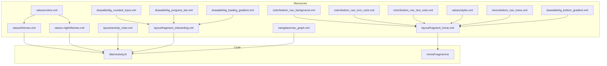
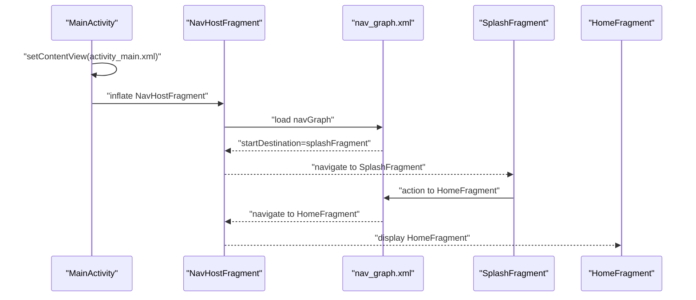
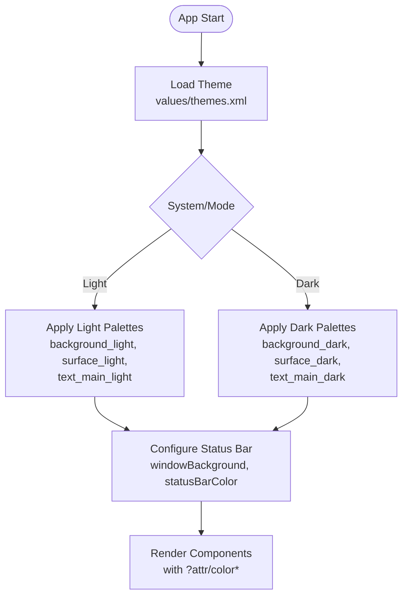
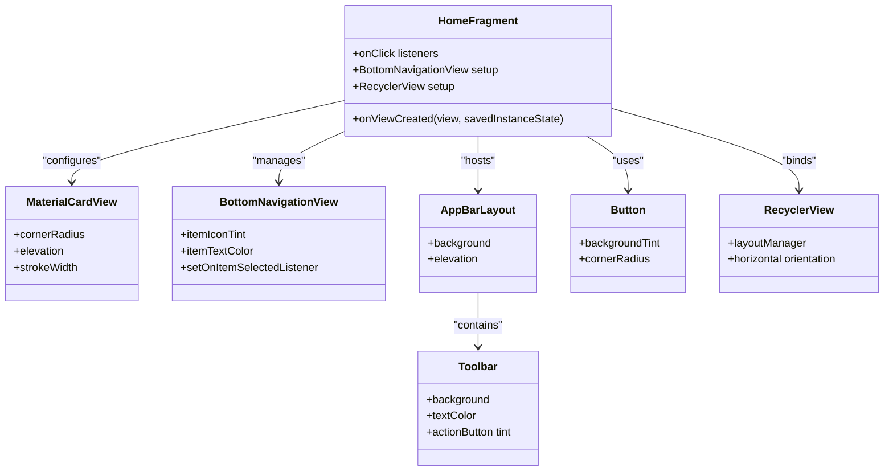
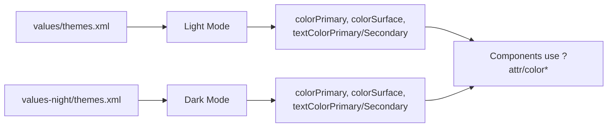
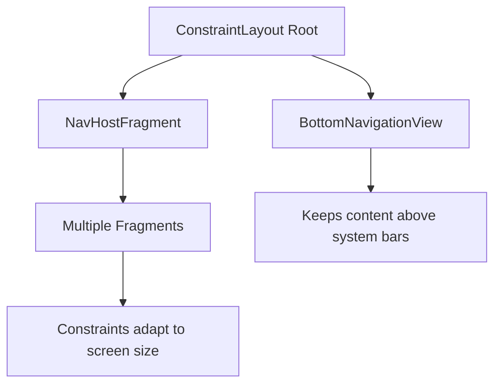
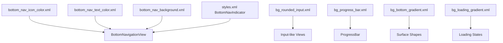
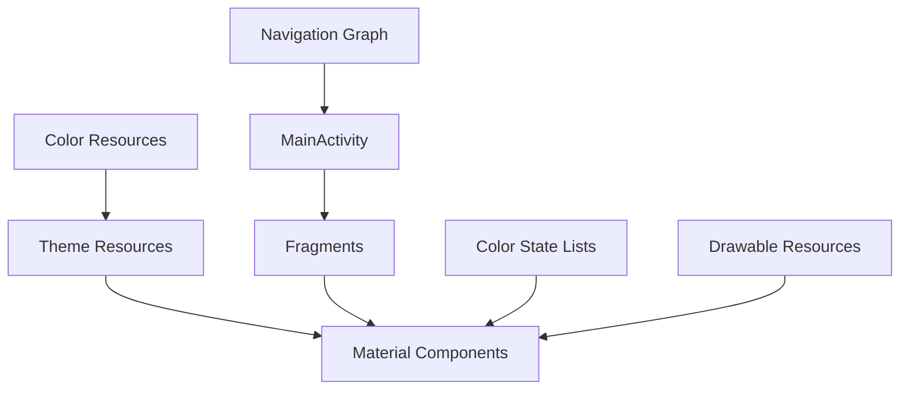

# Material Design Implementation

<cite>
**Referenced Files in This Document**
- [themes.xml](file://app/src/main/res/values/themes.xml)
- [themes.xml (night)](file://app/src/main/res/values-night/themes.xml)
- [colors.xml](file://app/src/main/res/values/colors.xml)
- [bottom_nav_background.xml](file://app/src/main/res/color/bottom_nav_background.xml)
- [bottom_nav_icon_color.xml](file://app/src/main/res/color/bottom_nav_icon_color.xml)
- [bottom_nav_text_color.xml](file://app/src/main/res/color/bottom_nav_text_color.xml)
- [styles.xml](file://app/src/main/res/values/styles.xml)
- [activity_main.xml](file://app/src/main/res/layout/activity_main.xml)
- [nav_graph.xml](file://app/src/main/res/navigation/nav_graph.xml)
- [bottom_nav_menu.xml](file://app/src/main/res/menu/bottom_nav_menu.xml)
- [fragment_home.xml](file://app/src/main/res/layout/fragment_home.xml)
- [fragment_onboarding.xml](file://app/src/main/res/layout/fragment_onboarding.xml)
- [bg_rounded_input.xml](file://app/src/main/res/drawable/bg_rounded_input.xml)
- [bg_progress_bar.xml](file://app/src/main/res/drawable/bg_progress_bar.xml)
- [bg_bottom_gradient.xml](file://app/src/main/res/drawable/bg_bottom_gradient.xml)
- [bg_loading_gradient.xml](file://app/src/main/res/drawable/bg_loading_gradient.xml)
- [MainActivity.kt](file://app/src/main/java/com/maheshsharan/tel2what/MainActivity.kt)
- [HomeFragment.kt](file://app/src/main/java/com/maheshsharan/tel2what/ui/home/HomeFragment.kt)
</cite>

## Table of Contents
1. [Introduction](#introduction)
2. [Project Structure](#project-structure)
3. [Core Components](#core-components)
4. [Architecture Overview](#architecture-overview)
5. [Detailed Component Analysis](#detailed-component-analysis)
6. [Dependency Analysis](#dependency-analysis)
7. [Performance Considerations](#performance-considerations)
8. [Accessibility Implementation](#accessibility-implementation)
9. [Cross-Device Compatibility](#cross-device-compatibility)
10. [Troubleshooting Guide](#troubleshooting-guide)
11. [Conclusion](#conclusion)

## Introduction
This document details the Material Design 3 implementation in Tel2What, focusing on theme configuration, color scheme usage, typography, Material Components adoption, dark/light theme support, responsive design patterns, custom styling, and accessibility considerations. The application leverages Android's Material Design 3 components and follows modern Android development practices with ConstraintLayout, Navigation Component, and resource qualifiers for day/night modes.

## Project Structure
The UI and theming resources are organized under the standard Android resources hierarchy:
- Themes and colors are defined in values and values-night directories
- Layouts use ConstraintLayout for responsive composition
- Navigation graphs coordinate fragment transitions
- Material Components are applied via XML attributes and programmatic configuration
- Color state lists manage bottom navigation appearance across checked states

**Diagram sources**
- [themes.xml](file://app/src/main/res/values/themes.xml#L1-L21)
- [themes.xml (night)](file://app/src/main/res/values-night/themes.xml#L1-L22)
- [colors.xml](file://app/src/main/res/values/colors.xml#L1-L28)
- [bottom_nav_background.xml](file://app/src/main/res/color/bottom_nav_background.xml#L1-L5)
- [bottom_nav_icon_color.xml](file://app/src/main/res/color/bottom_nav_icon_color.xml#L1-L6)
- [bottom_nav_text_color.xml](file://app/src/main/res/color/bottom_nav_text_color.xml#L1-L6)
- [styles.xml](file://app/src/main/res/values/styles.xml#L1-L8)
- [activity_main.xml](file://app/src/main/res/layout/activity_main.xml#L1-L16)
- [fragment_home.xml](file://app/src/main/res/layout/fragment_home.xml#L1-L210)
- [fragment_onboarding.xml](file://app/src/main/res/layout/fragment_onboarding.xml#L1-L48)
- [nav_graph.xml](file://app/src/main/res/navigation/nav_graph.xml#L1-L122)
- [bottom_nav_menu.xml](file://app/src/main/res/menu/bottom_nav_menu.xml#L1-L15)
- [bg_rounded_input.xml](file://app/src/main/res/drawable/bg_rounded_input.xml#L1-L8)
- [bg_progress_bar.xml](file://app/src/main/res/drawable/bg_progress_bar.xml#L1-L17)
- [bg_bottom_gradient.xml](file://app/src/main/res/drawable/bg_bottom_gradient.xml#L1-L4)
- [bg_loading_gradient.xml](file://app/src/main/res/drawable/bg_loading_gradient.xml#L1-L9)
- [MainActivity.kt](file://app/src/main/java/com/maheshsharan/tel2what/MainActivity.kt#L1-L13)
- [HomeFragment.kt](file://app/src/main/java/com/maheshsharan/tel2what/ui/home/HomeFragment.kt#L1-L106)

**Section sources**
- [themes.xml](file://app/src/main/res/values/themes.xml#L1-L21)
- [themes.xml (night)](file://app/src/main/res/values-night/themes.xml#L1-L22)
- [colors.xml](file://app/src/main/res/values/colors.xml#L1-L28)
- [activity_main.xml](file://app/src/main/res/layout/activity_main.xml#L1-L16)
- [nav_graph.xml](file://app/src/main/res/navigation/nav_graph.xml#L1-L122)
- [MainActivity.kt](file://app/src/main/java/com/maheshsharan/tel2what/MainActivity.kt#L1-L13)

## Core Components
- Theme configuration: The base theme inherits from Material3 Day/Night with custom color attributes for primary, surface, and text palettes. It sets window and status bar colors per mode.
- Color scheme: Brand primary palette with light/dark variants; surface and background colors adapt per mode; gradients support loading states.
- Typography: Text appearances rely on Material defaults with explicit sizes and weights in layouts.
- Material Components: MaterialCardView, BottomNavigationView, AppBarLayout/Toolbar, Buttons, and RecyclerView are used extensively.
- Navigation: Navigation Component coordinates fragment transitions with a start destination and actions.

**Section sources**
- [themes.xml](file://app/src/main/res/values/themes.xml#L2-L20)
- [themes.xml (night)](file://app/src/main/res/values-night/themes.xml#L3-L21)
- [colors.xml](file://app/src/main/res/values/colors.xml#L3-L24)
- [fragment_home.xml](file://app/src/main/res/layout/fragment_home.xml#L68-L156)
- [fragment_onboarding.xml](file://app/src/main/res/layout/fragment_onboarding.xml#L24-L33)
- [nav_graph.xml](file://app/src/main/res/navigation/nav_graph.xml#L6-L6)

## Architecture Overview
The application uses a single-activity architecture with a NavHostFragment hosting multiple destinations. The main activity inflates a ConstraintLayout containing the NavHostFragment. Navigation actions connect fragments defined in the navigation graph.

**Diagram sources**
- [activity_main.xml](file://app/src/main/res/layout/activity_main.xml#L8-L14)
- [nav_graph.xml](file://app/src/main/res/navigation/nav_graph.xml#L6-L24)
- [MainActivity.kt](file://app/src/main/java/com/maheshsharan/tel2what/MainActivity.kt#L8-L11)

**Section sources**
- [activity_main.xml](file://app/src/main/res/layout/activity_main.xml#L1-L16)
- [nav_graph.xml](file://app/src/main/res/navigation/nav_graph.xml#L1-L122)
- [MainActivity.kt](file://app/src/main/java/com/maheshsharan/tel2what/MainActivity.kt#L1-L13)

## Detailed Component Analysis

### Theme Configuration and Color Scheme
- Base theme: Inherits Material3 DayNight with NoActionBar, applying brand colors and surface palettes.
- Light mode: Uses light backgrounds and surfaces with appropriate text contrast.
- Dark mode: Uses dark backgrounds and surfaces with adjusted text colors.
- Active indicator style: Custom active indicator for BottomNavigationView using brand primary color.

**Diagram sources**
- [themes.xml](file://app/src/main/res/values/themes.xml#L2-L20)
- [themes.xml (night)](file://app/src/main/res/values-night/themes.xml#L3-L21)
- [colors.xml](file://app/src/main/res/values/colors.xml#L8-L20)
- [styles.xml](file://app/src/main/res/values/styles.xml#L3-L6)

**Section sources**
- [themes.xml](file://app/src/main/res/values/themes.xml#L1-L21)
- [themes.xml (night)](file://app/src/main/res/values-night/themes.xml#L1-L22)
- [colors.xml](file://app/src/main/res/values/colors.xml#L1-L28)
- [styles.xml](file://app/src/main/res/values/styles.xml#L1-L8)

### Material Components Usage
- MaterialCardView: Used for primary action cards and secondary action rows; configured with corner radius, elevation, and stroke width.
- BottomNavigationView: Integrated into HomeFragment layout with tinted icons and text using color state lists; active item highlighting disabled via indicator style.
- AppBarLayout/Toolbar: Toolbar styled with surface background and on-surface text; action button uses borderless selectable background.
- Buttons: Elevated buttons with rounded corners and primary background tint.
- RecyclerView: Horizontal list for recent packs with linear layout manager.

**Diagram sources**
- [HomeFragment.kt](file://app/src/main/java/com/maheshsharan/tel2what/ui/home/HomeFragment.kt#L35-L97)
- [fragment_home.xml](file://app/src/main/res/layout/fragment_home.xml#L68-L156)
- [fragment_home.xml](file://app/src/main/res/layout/fragment_home.xml#L198-L208)
- [fragment_home.xml](file://app/src/main/res/layout/fragment_home.xml#L10-L51)
- [fragment_onboarding.xml](file://app/src/main/res/layout/fragment_onboarding.xml#L24-L33)
- [fragment_home.xml](file://app/src/main/res/layout/fragment_home.xml#L185-L192)

**Section sources**
- [HomeFragment.kt](file://app/src/main/java/com/maheshsharan/tel2what/ui/home/HomeFragment.kt#L1-L106)
- [fragment_home.xml](file://app/src/main/res/layout/fragment_home.xml#L68-L156)
- [fragment_home.xml](file://app/src/main/res/layout/fragment_home.xml#L198-L208)
- [fragment_onboarding.xml](file://app/src/main/res/layout/fragment_onboarding.xml#L24-L33)

### Dark/Light Theme Support and Dynamic Theming
- Resource qualifiers: Separate themes.xml in values and values-night directories define mode-specific palettes and status bar behavior.
- Night mode resources: Bottom navigation background selector targets night variant folder for dark background.
- Window and status bar: Theme items set windowBackground, colorBackground, statusBarColor, and light status bar indicators per mode.

**Diagram sources**
- [themes.xml](file://app/src/main/res/values/themes.xml#L2-L20)
- [themes.xml (night)](file://app/src/main/res/values-night/themes.xml#L3-L21)
- [bottom_nav_background.xml](file://app/src/main/res/color-night/bottom_nav_background.xml)

**Section sources**
- [themes.xml](file://app/src/main/res/values/themes.xml#L1-L21)
- [themes.xml (night)](file://app/src/main/res/values-night/themes.xml#L1-L22)
- [bottom_nav_background.xml](file://app/src/main/res/color/bottom_nav_background.xml#L1-L5)

### Responsive Design Patterns and Adaptive UI
- ConstraintLayout: Used in activity and fragments to create flexible, constraint-driven layouts.
- Navigation Component: Centralized navigation graph defines destinations and transitions, enabling adaptive navigation across screen sizes.
- BottomNavigationView placement: Positioned at the bottom with elevation and constrained to the parent, suitable for mobile form factors.
- RecyclerView: Horizontal scrolling list adapts to available width.

**Diagram sources**
- [activity_main.xml](file://app/src/main/res/layout/activity_main.xml#L2-L14)
- [fragment_home.xml](file://app/src/main/res/layout/fragment_home.xml#L198-L208)
- [nav_graph.xml](file://app/src/main/res/navigation/nav_graph.xml#L1-L122)

**Section sources**
- [activity_main.xml](file://app/src/main/res/layout/activity_main.xml#L1-L16)
- [fragment_home.xml](file://app/src/main/res/layout/fragment_home.xml#L1-L210)
- [nav_graph.xml](file://app/src/main/res/navigation/nav_graph.xml#L1-L122)

### Custom Styling Approaches
- Color state lists: Bottom navigation icon and text colors change based on checked state; background selector adapts to mode.
- Drawable shapes: Rounded input background, progress bar layers, and gradient backgrounds use theme attributes for consistency.
- Active indicator: Custom style for BottomNavigationView active indicator using brand color and alpha.

**Diagram sources**
- [bottom_nav_icon_color.xml](file://app/src/main/res/color/bottom_nav_icon_color.xml#L1-L6)
- [bottom_nav_text_color.xml](file://app/src/main/res/color/bottom_nav_text_color.xml#L1-L6)
- [bottom_nav_background.xml](file://app/src/main/res/color/bottom_nav_background.xml#L1-L5)
- [styles.xml](file://app/src/main/res/values/styles.xml#L3-L6)
- [bg_rounded_input.xml](file://app/src/main/res/drawable/bg_rounded_input.xml#L1-L8)
- [bg_progress_bar.xml](file://app/src/main/res/drawable/bg_progress_bar.xml#L1-L17)
- [bg_bottom_gradient.xml](file://app/src/main/res/drawable/bg_bottom_gradient.xml#L1-L4)
- [bg_loading_gradient.xml](file://app/src/main/res/drawable/bg_loading_gradient.xml#L1-L9)

**Section sources**
- [bottom_nav_icon_color.xml](file://app/src/main/res/color/bottom_nav_icon_color.xml#L1-L6)
- [bottom_nav_text_color.xml](file://app/src/main/res/color/bottom_nav_text_color.xml#L1-L6)
- [bottom_nav_background.xml](file://app/src/main/res/color/bottom_nav_background.xml#L1-L5)
- [styles.xml](file://app/src/main/res/values/styles.xml#L1-L8)
- [bg_rounded_input.xml](file://app/src/main/res/drawable/bg_rounded_input.xml#L1-L8)
- [bg_progress_bar.xml](file://app/src/main/res/drawable/bg_progress_bar.xml#L1-L17)
- [bg_bottom_gradient.xml](file://app/src/main/res/drawable/bg_bottom_gradient.xml#L1-L4)
- [bg_loading_gradient.xml](file://app/src/main/res/drawable/bg_loading_gradient.xml#L1-L9)

### Typography Implementation
- Explicit text sizing and weights: Titles use larger sp sizes with bold weights; secondary text uses smaller sizes and lighter weights.
- Font family: Medium-weight sans-serif applied to key labels.
- Surface-aware text colors: Text colors derive from onSurface for optimal contrast against surfaces.

**Section sources**
- [fragment_home.xml](file://app/src/main/res/layout/fragment_home.xml#L23-L30)
- [fragment_home.xml](file://app/src/main/res/layout/fragment_home.xml#L91-L98)
- [fragment_home.xml](file://app/src/main/res/layout/fragment_home.xml#L140-L146)

## Dependency Analysis
The UI layer depends on:
- Theme resources for color attributes and status bar configuration
- Navigation graph for fragment transitions
- Material Components for UI primitives
- Color state lists and drawables for styling

**Diagram sources**
- [themes.xml](file://app/src/main/res/values/themes.xml#L2-L20)
- [colors.xml](file://app/src/main/res/values/colors.xml#L3-L24)
- [nav_graph.xml](file://app/src/main/res/navigation/nav_graph.xml#L6-L24)
- [MainActivity.kt](file://app/src/main/java/com/maheshsharan/tel2what/MainActivity.kt#L8-L11)
- [HomeFragment.kt](file://app/src/main/java/com/maheshsharan/tel2what/ui/home/HomeFragment.kt#L35-L97)
- [bottom_nav_icon_color.xml](file://app/src/main/res/color/bottom_nav_icon_color.xml#L1-L6)
- [bg_rounded_input.xml](file://app/src/main/res/drawable/bg_rounded_input.xml#L1-L8)

**Section sources**
- [themes.xml](file://app/src/main/res/values/themes.xml#L1-L21)
- [colors.xml](file://app/src/main/res/values/colors.xml#L1-L28)
- [nav_graph.xml](file://app/src/main/res/navigation/nav_graph.xml#L1-L122)
- [MainActivity.kt](file://app/src/main/java/com/maheshsharan/tel2what/MainActivity.kt#L1-L13)
- [HomeFragment.kt](file://app/src/main/java/com/maheshsharan/tel2what/ui/home/HomeFragment.kt#L1-L106)

## Performance Considerations
- ConstraintLayout minimizes nested views and improves measure/layout performance.
- RecyclerView with horizontal orientation efficiently renders small, fixed-height lists.
- MaterialCardView elevation and corner radius are lightweight; avoid excessive nesting inside cards.
- Navigation Component defers heavy work to fragments and view models; keep UI thread free for animations and interactions.

## Accessibility Implementation
- Content descriptions: Add contentDescription to actionable icons and buttons for screen reader support.
- Focus order: Maintain logical traversal order in ConstraintLayout; use focusable and focusableInTouchMode judiciously.
- Touch targets: Ensure interactive elements meet minimum touch target size guidelines.
- Color contrast: Verify sufficient contrast between foreground and background colors across light/dark modes.
- Navigation: Provide clear labels and titles for BottomNavigationView items.

## Cross-Device Compatibility
- ConstraintLayout ensures consistent scaling across densities and orientations.
- Navigation graph supports reconfiguration for tablets by adjusting fragment containers and menus.
- BottomNavigationView remains anchored at the bottom; consider top app bar for larger screens if needed.
- RecyclerView horizontal scrolling adapts to available width; ensure adequate spacing for portrait vs landscape.

## Troubleshooting Guide
- Theme not applying: Verify theme inheritance and that color attributes match resource names.
- Bottom navigation tint not working: Confirm color state list references and mode-specific selectors.
- Status bar color mismatch: Ensure statusBarColor and windowLightStatusBar are set appropriately per mode.
- Component colors not adapting: Use ?attr/color* references instead of hardcoded colors.

**Section sources**
- [themes.xml](file://app/src/main/res/values/themes.xml#L18-L20)
- [themes.xml (night)](file://app/src/main/res/values-night/themes.xml#L18-L21)
- [bottom_nav_icon_color.xml](file://app/src/main/res/color/bottom_nav_icon_color.xml#L1-L6)
- [bottom_nav_text_color.xml](file://app/src/main/res/color/bottom_nav_text_color.xml#L1-L6)

## Conclusion
Tel2What implements Material Design 3 with a clean, mode-aware theme, consistent color scheme, and thoughtful use of Material Components. The application leverages ConstraintLayout and Navigation Component for responsive layouts, employs color state lists and custom drawables for polished visuals, and maintains accessibility and cross-device compatibility through established Android patterns.