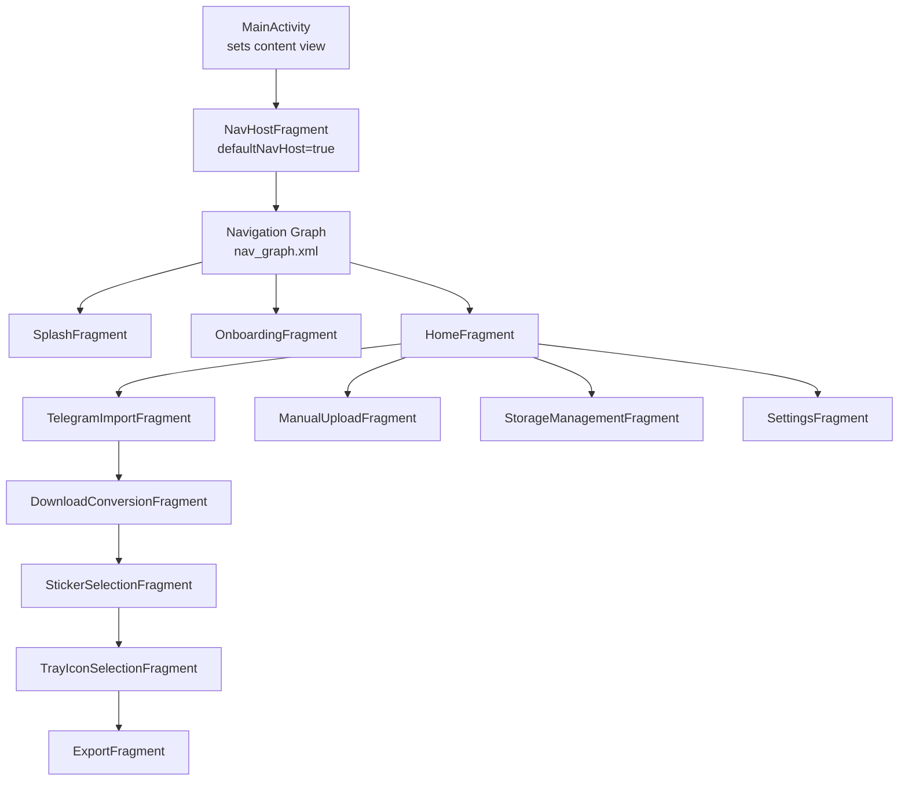
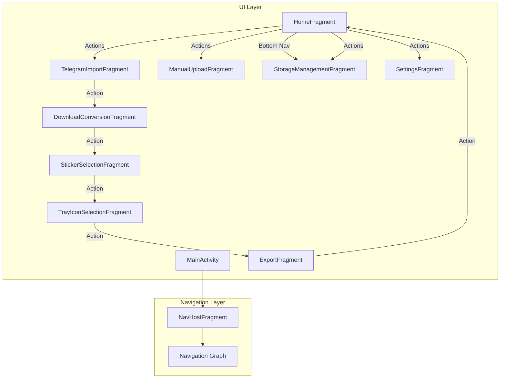
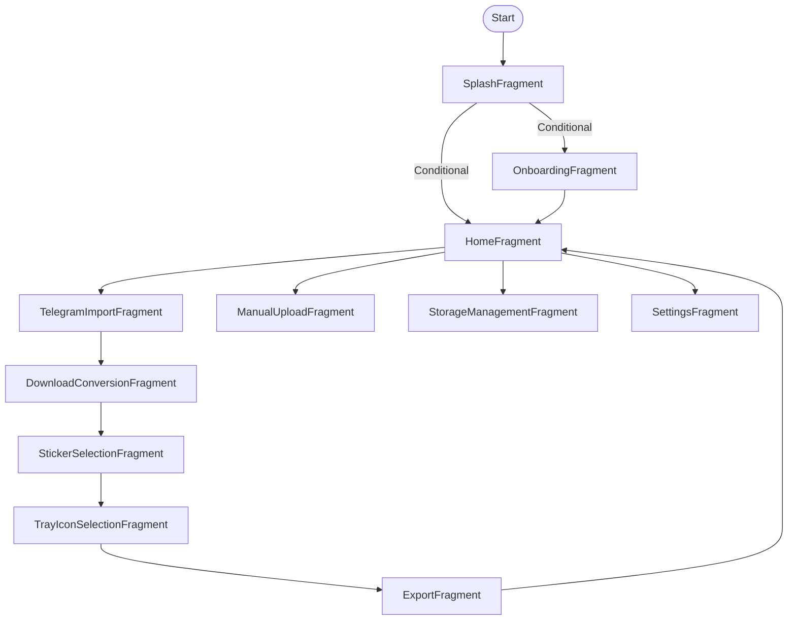
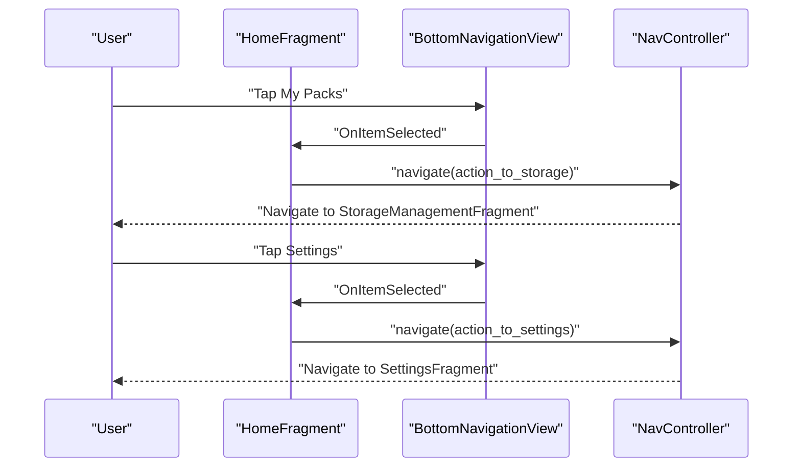
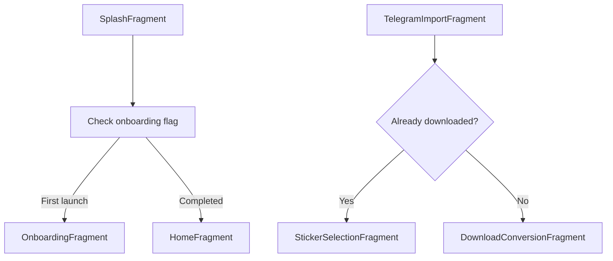
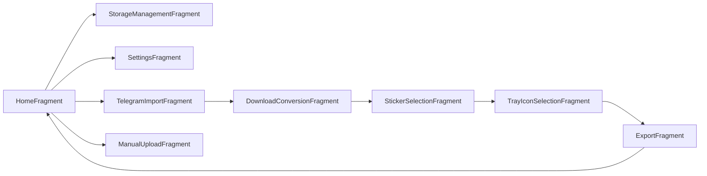

# Navigation System

<cite>
**Referenced Files in This Document**
- [nav_graph.xml](file://app/src/main/res/navigation/nav_graph.xml)
- [activity_main.xml](file://app/src/main/res/layout/activity_main.xml)
- [bottom_nav_menu.xml](file://app/src/main/res/menu/bottom_nav_menu.xml)
- [MainActivity.kt](file://app/src/main/java/com/maheshsharan/tel2what/MainActivity.kt)
- [SplashFragment.kt](file://app/src/main/java/com/maheshsharan/tel2what/ui/splash/SplashFragment.kt)
- [OnboardingFragment.kt](file://app/src/main/java/com/maheshsharan/tel2what/ui/onboarding/OnboardingFragment.kt)
- [HomeFragment.kt](file://app/src/main/java/com/maheshsharan/tel2what/ui/home/HomeFragment.kt)
- [TelegramImportFragment.kt](file://app/src/main/java/com/maheshsharan/tel2what/ui/importpack/TelegramImportFragment.kt)
- [DownloadConversionFragment.kt](file://app/src/main/java/com/maheshsharan/tel2what/ui/conversion/DownloadConversionFragment.kt)
- [StickerSelectionFragment.kt](file://app/src/main/java/com/maheshsharan/tel2what/ui/selection/StickerSelectionFragment.kt)
- [TrayIconSelectionFragment.kt](file://app/src/main/java/com/maheshsharan/tel2what/ui/trayicon/TrayIconSelectionFragment.kt)
- [ExportFragment.kt](file://app/src/main/java/com/maheshsharan/tel2what/ui/export/ExportFragment.kt)
- [ManualUploadFragment.kt](file://app/src/main/java/com/maheshsharan/tel2what/ui/manual/ManualUploadFragment.kt)
- [StorageManagementFragment.kt](file://app/src/main/java/com/maheshsharan/tel2what/ui/storage/StorageManagementFragment.kt)
- [SettingsFragment.kt](file://app/src/main/java/com/maheshsharan/tel2what/ui/settings/SettingsFragment.kt)
</cite>

## Table of Contents
1. [Introduction](#introduction)
2. [Project Structure](#project-structure)
3. [Core Components](#core-components)
4. [Architecture Overview](#architecture-overview)
5. [Detailed Component Analysis](#detailed-component-analysis)
6. [Dependency Analysis](#dependency-analysis)
7. [Performance Considerations](#performance-considerations)
8. [Troubleshooting Guide](#troubleshooting-guide)
9. [Conclusion](#conclusion)

## Introduction
This document explains Tel2What’s navigation system built on Android Jetpack Navigation Component. It covers the fragment-based navigation architecture, the navigation graph configuration, fragment transitions, bottom navigation integration, NavController usage, destination handling, bundle parameter passing, navigation actions, deep linking support, back stack management, programmatic navigation patterns, conditional flows, and navigation state preservation. It also includes performance and memory management best practices derived from the codebase.

## Project Structure
The navigation system centers around a single-activity architecture:
- The host activity sets up a NavHostFragment and binds it to a navigation graph.
- Fragments implement navigation actions and pass parameters via Bundles.
- A bottom navigation bar integrates with the main HomeFragment destinations.

**Diagram sources**
- [activity_main.xml](file://app/src/main/res/layout/activity_main.xml#L8-L14)
- [nav_graph.xml](file://app/src/main/res/navigation/nav_graph.xml#L1-L122)
- [MainActivity.kt](file://app/src/main/java/com/maheshsharan/tel2what/MainActivity.kt#L6-L11)

**Section sources**
- [activity_main.xml](file://app/src/main/res/layout/activity_main.xml#L1-L16)
- [nav_graph.xml](file://app/src/main/res/navigation/nav_graph.xml#L1-L122)
- [MainActivity.kt](file://app/src/main/java/com/maheshsharan/tel2what/MainActivity.kt#L1-L13)

## Core Components
- NavHostFragment: Hosts the navigation graph and manages fragment transactions.
- Navigation Graph: Defines start destination and all destinations with actions and optional pop behavior.
- BottomNavigationView: Integrated inside HomeFragment to switch between primary destinations.
- NavController: Used by fragments to navigate programmatically and manage back stack.
- Bundle Parameter Passing: Used to pass contextual data between fragments along navigation actions.

Key implementation references:
- NavHost setup and graph binding in the activity layout.
- Navigation graph with start destination and actions.
- Bottom navigation handling inside HomeFragment.
- Programmatic navigation and bundle passing across fragments.

**Section sources**
- [activity_main.xml](file://app/src/main/res/layout/activity_main.xml#L8-L14)
- [nav_graph.xml](file://app/src/main/res/navigation/nav_graph.xml#L5-L6)
- [HomeFragment.kt](file://app/src/main/java/com/maheshsharan/tel2what/ui/home/HomeFragment.kt#L82-L97)
- [TelegramImportFragment.kt](file://app/src/main/java/com/maheshsharan/tel2what/ui/importpack/TelegramImportFragment.kt#L121-L128)
- [DownloadConversionFragment.kt](file://app/src/main/java/com/maheshsharan/tel2what/ui/conversion/DownloadConversionFragment.kt#L118-L123)
- [StickerSelectionFragment.kt](file://app/src/main/java/com/maheshsharan/tel2what/ui/selection/StickerSelectionFragment.kt#L79-L90)
- [TrayIconSelectionFragment.kt](file://app/src/main/java/com/maheshsharan/tel2what/ui/trayicon/TrayIconSelectionFragment.kt#L91-L96)
- [ExportFragment.kt](file://app/src/main/java/com/maheshsharan/tel2what/ui/export/ExportFragment.kt#L31)

## Architecture Overview
The navigation architecture follows a layered pattern:
- UI Layer: Activities and Fragments.
- Navigation Layer: NavHostFragment and Navigation Graph.
- State Layer: ViewModel-driven UI state updates and navigation triggers.
- Data Layer: Repository and network/local data sources.

**Diagram sources**
- [activity_main.xml](file://app/src/main/res/layout/activity_main.xml#L8-L14)
- [nav_graph.xml](file://app/src/main/res/navigation/nav_graph.xml#L1-L122)
- [HomeFragment.kt](file://app/src/main/java/com/maheshsharan/tel2what/ui/home/HomeFragment.kt#L82-L97)
- [TelegramImportFragment.kt](file://app/src/main/java/com/maheshsharan/tel2what/ui/importpack/TelegramImportFragment.kt#L121-L128)
- [DownloadConversionFragment.kt](file://app/src/main/java/com/maheshsharan/tel2what/ui/conversion/DownloadConversionFragment.kt#L118-L123)
- [StickerSelectionFragment.kt](file://app/src/main/java/com/maheshsharan/tel2what/ui/selection/StickerSelectionFragment.kt#L79-L90)
- [TrayIconSelectionFragment.kt](file://app/src/main/java/com/maheshsharan/tel2what/ui/trayicon/TrayIconSelectionFragment.kt#L91-L96)
- [ExportFragment.kt](file://app/src/main/java/com/maheshsharan/tel2what/ui/export/ExportFragment.kt#L31)

## Detailed Component Analysis

### Navigation Graph Configuration
- Start destination: SplashFragment.
- Hierarchical actions define forward navigation and optional back stack manipulation using popUpTo and popUpToInclusive.
- Destinations include onboarding, home, import, conversion, selection, tray icon, export, manual upload, storage, and settings.

**Diagram sources**
- [nav_graph.xml](file://app/src/main/res/navigation/nav_graph.xml#L6-L122)

**Section sources**
- [nav_graph.xml](file://app/src/main/res/navigation/nav_graph.xml#L1-L122)

### Bottom Navigation Implementation
- BottomNavigationView resides in HomeFragment and controls navigation to StorageManagementFragment and SettingsFragment.
- The selected item is pre-set to Home to reflect current context.
- Navigation uses NavController actions to move between destinations.

**Diagram sources**
- [HomeFragment.kt](file://app/src/main/java/com/maheshsharan/tel2what/ui/home/HomeFragment.kt#L82-L97)
- [bottom_nav_menu.xml](file://app/src/main/res/menu/bottom_nav_menu.xml#L1-L15)

**Section sources**
- [HomeFragment.kt](file://app/src/main/java/com/maheshsharan/tel2what/ui/home/HomeFragment.kt#L82-L97)
- [bottom_nav_menu.xml](file://app/src/main/res/menu/bottom_nav_menu.xml#L1-L15)

### NavController Usage and Destination Handling
- NavController is accessed via findNavController() within fragments.
- Navigation actions are invoked using action IDs defined in the navigation graph.
- navigateUp() is used to return to the previous destination in the back stack.

Examples:
- Programmatic navigation from HomeFragment to Import/Manual/Storage/Settings.
- navigateUp() from child fragments to return upstream.

**Section sources**
- [HomeFragment.kt](file://app/src/main/java/com/maheshsharan/tel2what/ui/home/HomeFragment.kt#L70-L80)
- [StorageManagementFragment.kt](file://app/src/main/java/com/maheshsharan/tel2what/ui/storage/StorageManagementFragment.kt#L76-L78)
- [SettingsFragment.kt](file://app/src/main/java/com/maheshsharan/tel2what/ui/settings/SettingsFragment.kt#L30-L32)

### Bundle Parameter Passing Between Fragments
- Bundles carry contextual data such as pack identifiers and metadata.
- Examples:
  - Passing packName from TelegramImportFragment to DownloadConversionFragment.
  - Passing packName and selectedIds from StickerSelectionFragment to TrayIconSelectionFragment.
  - Passing packName from ExportFragment back to HomeFragment.

**Section sources**
- [TelegramImportFragment.kt](file://app/src/main/java/com/maheshsharan/tel2what/ui/importpack/TelegramImportFragment.kt#L121-L128)
- [DownloadConversionFragment.kt](file://app/src/main/java/com/maheshsharan/tel2what/ui/conversion/DownloadConversionFragment.kt#L118-L123)
- [StickerSelectionFragment.kt](file://app/src/main/java/com/maheshsharan/tel2what/ui/selection/StickerSelectionFragment.kt#L79-L90)
- [TrayIconSelectionFragment.kt](file://app/src/main/java/com/maheshsharan/tel2what/ui/trayicon/TrayIconSelectionFragment.kt#L91-L96)
- [ExportFragment.kt](file://app/src/main/java/com/maheshsharan/tel2what/ui/export/ExportFragment.kt#L31)

### Navigation Actions and Back Stack Management
- Actions define forward navigation and optional back stack modifications using popUpTo and popUpToInclusive.
- Typical patterns:
  - popUpToInclusive on splash/onboarding actions to remove the start destination after navigating.
  - popUpTo on export action to reset to HomeFragment.

**Section sources**
- [nav_graph.xml](file://app/src/main/res/navigation/nav_graph.xml#L13-L23)
- [nav_graph.xml](file://app/src/main/res/navigation/nav_graph.xml#L31-L35)
- [nav_graph.xml](file://app/src/main/res/navigation/nav_graph.xml#L96-L100)

### Conditional Navigation Flows
- SplashFragment conditionally navigates to OnboardingFragment or HomeFragment based on a shared preference flag.
- TelegramImportFragment conditionally navigates to DownloadConversionFragment or directly to StickerSelectionFragment depending on whether the pack was already downloaded.

**Diagram sources**
- [SplashFragment.kt](file://app/src/main/java/com/maheshsharan/tel2what/ui/splash/SplashFragment.kt#L63-L76)
- [TelegramImportFragment.kt](file://app/src/main/java/com/maheshsharan/tel2what/ui/importpack/TelegramImportFragment.kt#L130-L143)

**Section sources**
- [SplashFragment.kt](file://app/src/main/java/com/maheshsharan/tel2what/ui/splash/SplashFragment.kt#L63-L76)
- [TelegramImportFragment.kt](file://app/src/main/java/com/maheshsharan/tel2what/ui/importpack/TelegramImportFragment.kt#L130-L143)

### Deep Linking Support
- The navigation graph does not declare explicit deep links in the provided XML.
- Deep linking would typically be configured in the graph XML or via Activity intent filters; absent here, so deep linking is not enabled in the current configuration.

**Section sources**
- [nav_graph.xml](file://app/src/main/res/navigation/nav_graph.xml#L1-L122)

### Navigation State Preservation
- Back stack management relies on actions with popUpTo/popUpToInclusive to maintain clean navigation history.
- Programmatic navigation preserves state by passing Bundles and using navigateUp() to return to prior screens.

**Section sources**
- [nav_graph.xml](file://app/src/main/res/navigation/nav_graph.xml#L13-L23)
- [nav_graph.xml](file://app/src/main/res/navigation/nav_graph.xml#L96-L100)
- [StorageManagementFragment.kt](file://app/src/main/java/com/maheshsharan/tel2what/ui/storage/StorageManagementFragment.kt#L76-L78)
- [SettingsFragment.kt](file://app/src/main/java/com/maheshsharan/tel2what/ui/settings/SettingsFragment.kt#L30-L32)

## Dependency Analysis
- HomeFragment depends on BottomNavigationView and NavController to route to Storage and Settings.
- Import and Manual flows depend on TelegramImportFragment and ManualUploadFragment respectively, which then lead to conversion and selection steps.
- ExportFragment concludes the pipeline and returns to HomeFragment.

**Diagram sources**
- [HomeFragment.kt](file://app/src/main/java/com/maheshsharan/tel2what/ui/home/HomeFragment.kt#L82-L97)
- [TelegramImportFragment.kt](file://app/src/main/java/com/maheshsharan/tel2what/ui/importpack/TelegramImportFragment.kt#L121-L128)
- [ManualUploadFragment.kt](file://app/src/main/java/com/maheshsharan/tel2what/ui/manual/ManualUploadFragment.kt#L81-L88)
- [DownloadConversionFragment.kt](file://app/src/main/java/com/maheshsharan/tel2what/ui/conversion/DownloadConversionFragment.kt#L118-L123)
- [StickerSelectionFragment.kt](file://app/src/main/java/com/maheshsharan/tel2what/ui/selection/StickerSelectionFragment.kt#L79-L90)
- [TrayIconSelectionFragment.kt](file://app/src/main/java/com/maheshsharan/tel2what/ui/trayicon/TrayIconSelectionFragment.kt#L91-L96)
- [ExportFragment.kt](file://app/src/main/java/com/maheshsharan/tel2what/ui/export/ExportFragment.kt#L31)

**Section sources**
- [HomeFragment.kt](file://app/src/main/java/com/maheshsharan/tel2what/ui/home/HomeFragment.kt#L82-L97)
- [TelegramImportFragment.kt](file://app/src/main/java/com/maheshsharan/tel2what/ui/importpack/TelegramImportFragment.kt#L121-L128)
- [ManualUploadFragment.kt](file://app/src/main/java/com/maheshsharan/tel2what/ui/manual/ManualUploadFragment.kt#L81-L88)
- [DownloadConversionFragment.kt](file://app/src/main/java/com/maheshsharan/tel2what/ui/conversion/DownloadConversionFragment.kt#L118-L123)
- [StickerSelectionFragment.kt](file://app/src/main/java/com/maheshsharan/tel2what/ui/selection/StickerSelectionFragment.kt#L79-L90)
- [TrayIconSelectionFragment.kt](file://app/src/main/java/com/maheshsharan/tel2what/ui/trayicon/TrayIconSelectionFragment.kt#L91-L96)
- [ExportFragment.kt](file://app/src/main/java/com/maheshsharan/tel2what/ui/export/ExportFragment.kt#L31)

## Performance Considerations
- Avoid heavy work on the main thread during navigation; observe state streams and update UI reactively.
- Use navigateUp() to avoid recreating fragments unnecessarily.
- Reuse adapters and clear references in onDestroyView() to prevent memory leaks.
- Limit unnecessary Bundle sizes; pass minimal identifiers and fetch data in target fragments.
- Prefer action-based navigation for predictable back stacks and reduced boilerplate.

[No sources needed since this section provides general guidance]

## Troubleshooting Guide
- Navigation not working:
  - Ensure NavHostFragment is present and bound to the navigation graph.
  - Verify action IDs match between source fragment and graph.
- Back stack issues:
  - Confirm popUpTo and popUpToInclusive are set appropriately in actions.
- Bottom navigation misbehavior:
  - Check selectedItemId initialization and item selection callbacks.
- Parameter passing:
  - Validate keys used in Bundle and retrieval in target fragment.

**Section sources**
- [activity_main.xml](file://app/src/main/res/layout/activity_main.xml#L8-L14)
- [nav_graph.xml](file://app/src/main/res/navigation/nav_graph.xml#L13-L23)
- [HomeFragment.kt](file://app/src/main/java/com/maheshsharan/tel2what/ui/home/HomeFragment.kt#L82-L97)

## Conclusion
Tel2What’s navigation system leverages a clean, action-driven architecture with a single NavHostFragment and a well-defined navigation graph. Bottom navigation complements the main HomeFragment destinations, while programmatic navigation and bundle passing enable contextual flows across the import-to-export pipeline. Back stack management via actions ensures predictable navigation behavior, and reactive UI updates keep the system responsive. Following the best practices outlined here will help maintain performance and reliability as the app evolves.