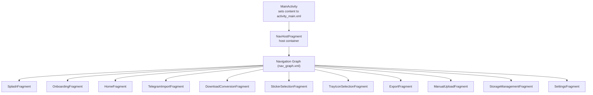
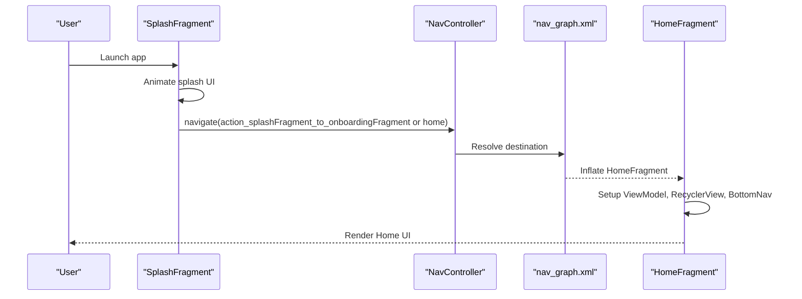
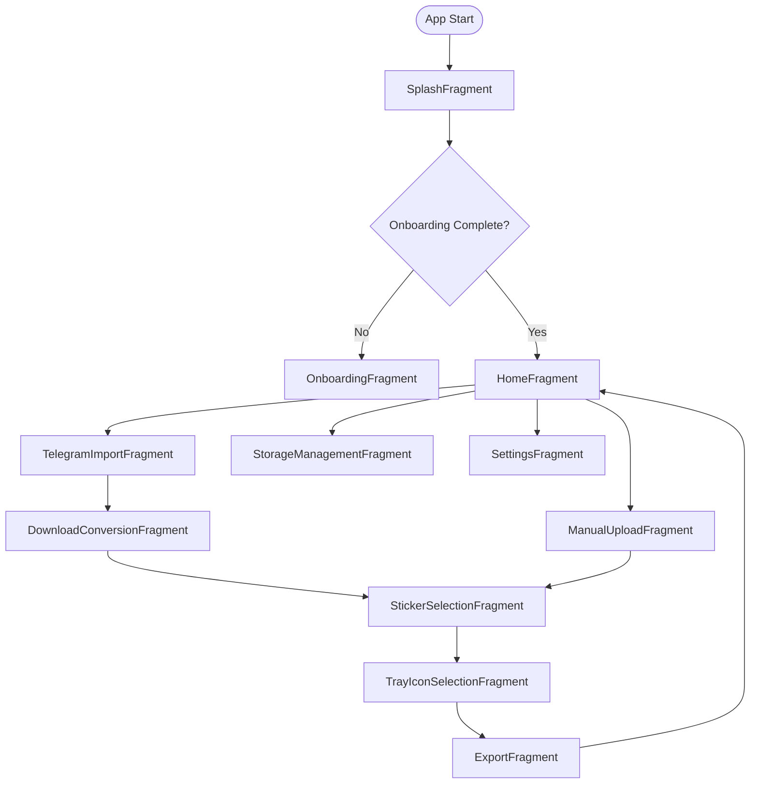
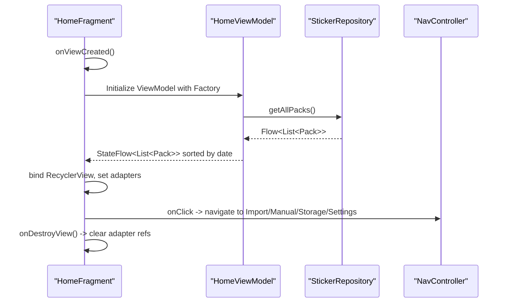
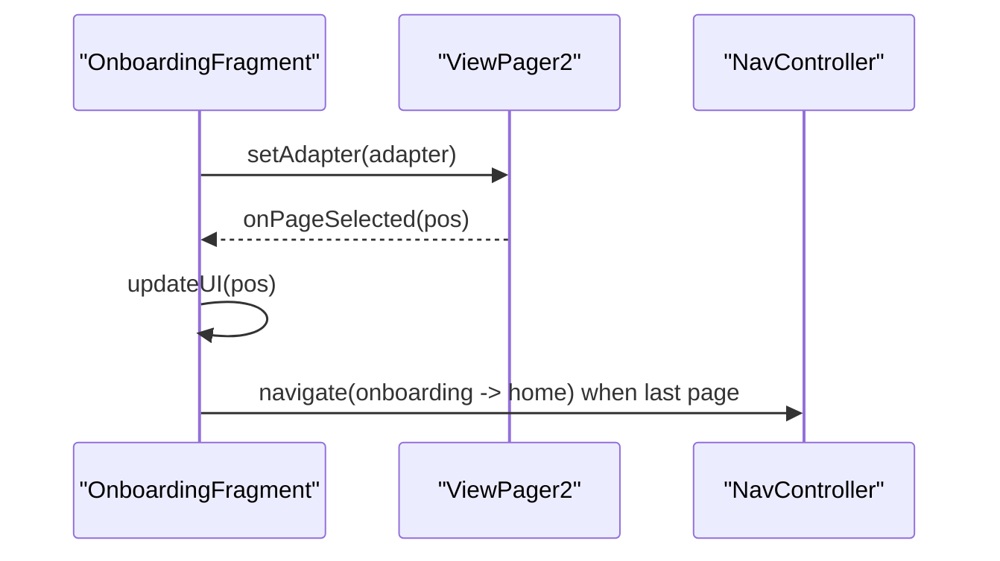
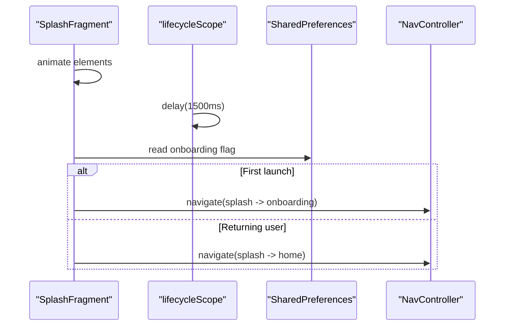
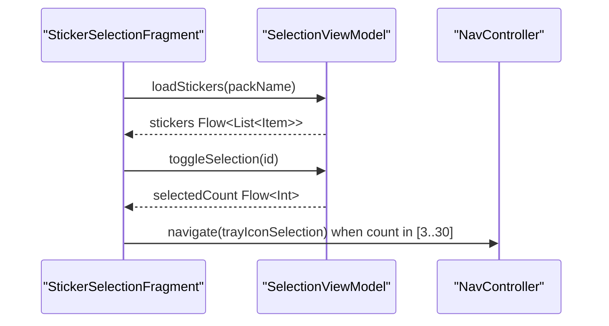
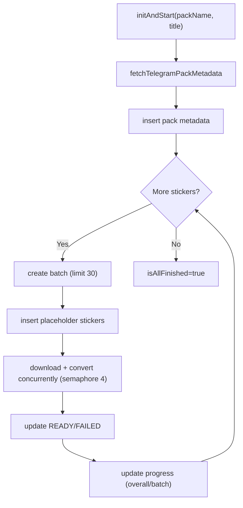
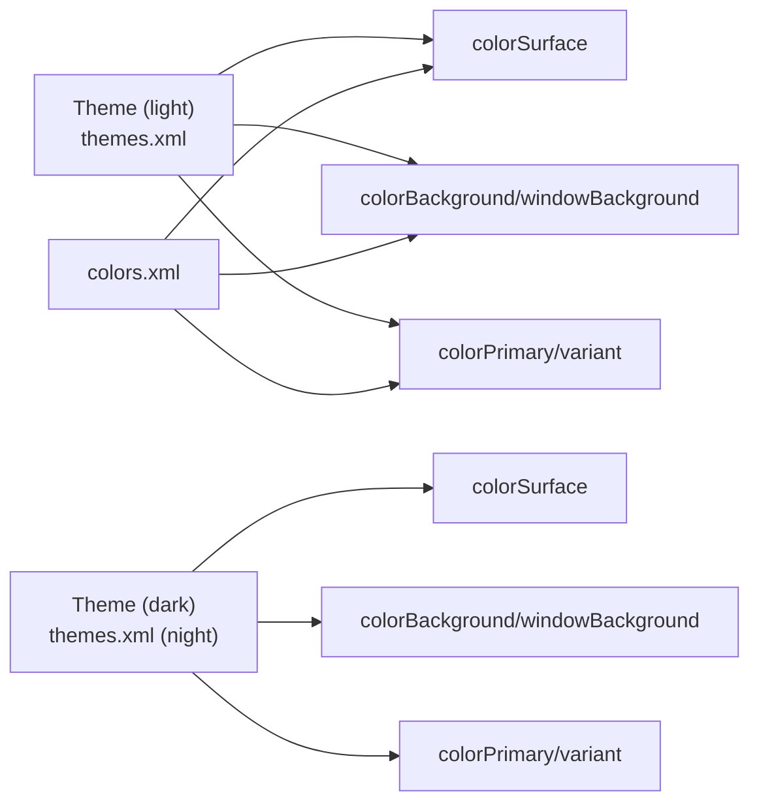
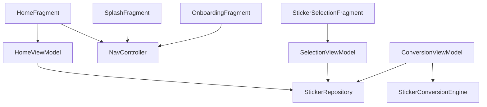

# UI Components and User Interface

<cite>
**Referenced Files in This Document**
- [MainActivity.kt](file://app/src/main/java/com/maheshsharan/tel2what/MainActivity.kt)
- [activity_main.xml](file://app/src/main/res/layout/activity_main.xml)
- [nav_graph.xml](file://app/src/main/res/navigation/nav_graph.xml)
- [HomeFragment.kt](file://app/src/main/java/com/maheshsharan/tel2what/ui/home/HomeFragment.kt)
- [fragment_home.xml](file://app/src/main/res/layout/fragment_home.xml)
- [HomeViewModel.kt](file://app/src/main/java/com/maheshsharan/tel2what/ui/home/HomeViewModel.kt)
- [OnboardingFragment.kt](file://app/src/main/java/com/maheshsharan/tel2what/ui/onboarding/OnboardingFragment.kt)
- [fragment_onboarding.xml](file://app/src/main/res/layout/fragment_onboarding.xml)
- [SplashFragment.kt](file://app/src/main/java/com/maheshsharan/tel2what/ui/splash/SplashFragment.kt)
- [fragment_splash.xml](file://app/src/main/res/layout/fragment_splash.xml)
- [StickerSelectionFragment.kt](file://app/src/main/java/com/maheshsharan/tel2what/ui/selection/StickerSelectionFragment.kt)
- [ConversionViewModel.kt](file://app/src/main/java/com/maheshsharan/tel2what/ui/conversion/ConversionViewModel.kt)
- [themes.xml](file://app/src/main/res/values/themes.xml)
- [themes.xml (night)](file://app/src/main/res/values-night/themes.xml)
- [colors.xml](file://app/src/main/res/values/colors.xml)
- [bottom_nav_menu.xml](file://app/src/main/res/menu/bottom_nav_menu.xml)
- [ManualUploadFragment.kt](file://app/src/main/java/com/maheshsharan/tel2what/ui/manual/ManualUploadFragment.kt)
- [StorageManagementFragment.kt](file://app/src/main/java/com/maheshsharan/tel2what/ui/storage/StorageManagementFragment.kt)
</cite>

## Table of Contents
1. [Introduction](#introduction)
2. [Project Structure](#project-structure)
3. [Core Components](#core-components)
4. [Architecture Overview](#architecture-overview)
5. [Detailed Component Analysis](#detailed-component-analysis)
6. [Dependency Analysis](#dependency-analysis)
7. [Performance Considerations](#performance-considerations)
8. [Troubleshooting Guide](#troubleshooting-guide)
9. [Conclusion](#conclusion)
10. [Appendices](#appendices)

## Introduction
This document explains the UI components and user interface implementation of Tel2What. It covers the fragment-based navigation system, how fragments manage UI state and lifecycle, Material Design 3 theming, ViewModel state management with reactive streams, navigation graph configuration and transitions, component composition patterns, accessibility considerations, and guidelines for customization and cross-device compatibility.

## Project Structure
The UI is built around a single-activity architecture using a NavHost and a navigation graph. Fragments encapsulate screens and orchestrate UI state via ViewModels. Layouts define Material Design 3 components and theming attributes. Resources provide light/dark themes and color palettes.

**Diagram sources**
- [activity_main.xml](file://app/src/main/res/layout/activity_main.xml#L8-L14)
- [nav_graph.xml](file://app/src/main/res/navigation/nav_graph.xml#L1-L122)

**Section sources**
- [MainActivity.kt](file://app/src/main/java/com/maheshsharan/tel2what/MainActivity.kt#L1-L13)
- [activity_main.xml](file://app/src/main/res/layout/activity_main.xml#L1-L16)
- [nav_graph.xml](file://app/src/main/res/navigation/nav_graph.xml#L1-L122)

## Core Components
- Single Activity with NavHost: The activity hosts a NavHostFragment that loads the navigation graph.
- Fragment-based Screens: Each screen is a dedicated Fragment with its own layout and ViewModel.
- Material Design 3: Uses Material components (cards, bottom navigation, toolbar) with theme-driven colors.
- Reactive State: ViewModels expose StateFlow/Flow to drive UI updates reactively.
- Navigation Graph: Centralized routing among fragments with actions and destinations.

**Section sources**
- [MainActivity.kt](file://app/src/main/java/com/maheshsharan/tel2what/MainActivity.kt#L6-L11)
- [activity_main.xml](file://app/src/main/res/layout/activity_main.xml#L8-L14)
- [nav_graph.xml](file://app/src/main/res/navigation/nav_graph.xml#L1-L122)
- [HomeViewModel.kt](file://app/src/main/java/com/maheshsharan/tel2what/ui/home/HomeViewModel.kt#L8-L13)

## Architecture Overview
The UI architecture follows MVVM with reactive streams:
- Fragments observe StateFlow/Flow from ViewModels.
- ViewModels encapsulate business logic and coordinate repositories.
- Navigation is declarative via the navigation graph.

**Diagram sources**
- [SplashFragment.kt](file://app/src/main/java/com/maheshsharan/tel2what/ui/splash/SplashFragment.kt#L63-L76)
- [nav_graph.xml](file://app/src/main/res/navigation/nav_graph.xml#L8-L24)
- [HomeFragment.kt](file://app/src/main/java/com/maheshsharan/tel2what/ui/home/HomeFragment.kt#L25-L84)

## Detailed Component Analysis

### Navigation System and Graph
- NavHost in activity_main.xml hosts the navigation graph.
- nav_graph.xml defines start destination and actions between fragments.
- Actions include popUpTo and inclusive flags to control back stack behavior.

**Diagram sources**
- [activity_main.xml](file://app/src/main/res/layout/activity_main.xml#L8-L14)
- [nav_graph.xml](file://app/src/main/res/navigation/nav_graph.xml#L1-L122)

**Section sources**
- [activity_main.xml](file://app/src/main/res/layout/activity_main.xml#L8-L14)
- [nav_graph.xml](file://app/src/main/res/navigation/nav_graph.xml#L1-L122)

### Home Screen: Composition and Lifecycle
- Fragment inflates fragment_home.xml with Material components.
- Sets up RecyclerView with a horizontal layout and adapter.
- Observes a Flow of recent packs and updates UI reactively.
- Bottom navigation delegates to NavController for navigation.

**Diagram sources**
- [HomeFragment.kt](file://app/src/main/java/com/maheshsharan/tel2what/ui/home/HomeFragment.kt#L25-L91)
- [HomeViewModel.kt](file://app/src/main/java/com/maheshsharan/tel2what/ui/home/HomeViewModel.kt#L8-L13)
- [fragment_home.xml](file://app/src/main/res/layout/fragment_home.xml#L68-L208)

**Section sources**
- [HomeFragment.kt](file://app/src/main/java/com/maheshsharan/tel2what/ui/home/HomeFragment.kt#L20-L91)
- [fragment_home.xml](file://app/src/main/res/layout/fragment_home.xml#L1-L210)
- [HomeViewModel.kt](file://app/src/main/java/com/maheshsharan/tel2what/ui/home/HomeViewModel.kt#L8-L13)

### Onboarding: ViewPager2 and Navigation
- OnboardingFragment uses ViewPager2 with a custom adapter.
- Updates button text based on page position.
- Completes onboarding by writing a preference and navigating to Home.

**Diagram sources**
- [OnboardingFragment.kt](file://app/src/main/java/com/maheshsharan/tel2what/ui/onboarding/OnboardingFragment.kt#L18-L67)
- [fragment_onboarding.xml](file://app/src/main/res/layout/fragment_onboarding.xml#L9-L45)

**Section sources**
- [OnboardingFragment.kt](file://app/src/main/java/com/maheshsharan/tel2what/ui/onboarding/OnboardingFragment.kt#L12-L69)
- [fragment_onboarding.xml](file://app/src/main/res/layout/fragment_onboarding.xml#L1-L48)

### Splash: Animation and Conditional Navigation
- Animates logo/title/subtitle/version with staggered alpha/translation.
- After delay, checks onboarding completion and navigates accordingly.

**Diagram sources**
- [SplashFragment.kt](file://app/src/main/java/com/maheshsharan/tel2what/ui/splash/SplashFragment.kt#L14-L76)
- [fragment_splash.xml](file://app/src/main/res/layout/fragment_splash.xml#L9-L70)

**Section sources**
- [SplashFragment.kt](file://app/src/main/java/com/maheshsharan/tel2what/ui/splash/SplashFragment.kt#L12-L79)
- [fragment_splash.xml](file://app/src/main/res/layout/fragment_splash.xml#L1-L72)

### Sticker Selection: Reactive UI and Validation
- Loads stickers for a given pack and exposes selection state via Flow.
- Enforces selection bounds (3–30) and navigates to tray icon selection.

**Diagram sources**
- [StickerSelectionFragment.kt](file://app/src/main/java/com/maheshsharan/tel2what/ui/selection/StickerSelectionFragment.kt#L31-L91)

**Section sources**
- [StickerSelectionFragment.kt](file://app/src/main/java/com/maheshsharan/tel2what/ui/selection/StickerSelectionFragment.kt#L22-L93)

### Conversion Pipeline: ViewModel State and Concurrency
- ConversionViewModel orchestrates fetching metadata, downloading, converting, and updating DB.
- Uses StateFlow for progress and sticker lists; Flow for reactive UI binding.
- Implements batching, concurrency control, and graceful cancellation.

**Diagram sources**
- [ConversionViewModel.kt](file://app/src/main/java/com/maheshsharan/tel2what/ui/conversion/ConversionViewModel.kt#L66-L329)

**Section sources**
- [ConversionViewModel.kt](file://app/src/main/java/com/maheshsharan/tel2what/ui/conversion/ConversionViewModel.kt#L39-L442)

### Theming and Material Design 3
- Theme derives from Theme.Material3.DayNight.NoActionBar with M3 color roles.
- Light and dark variants define surface, background, primary, and text colors.
- Layouts use Material components with attributes bound to theme colors.

**Diagram sources**
- [themes.xml](file://app/src/main/res/values/themes.xml#L1-L21)
- [themes.xml (night)](file://app/src/main/res/values-night/themes.xml#L1-L22)
- [colors.xml](file://app/src/main/res/values/colors.xml#L1-L28)

**Section sources**
- [themes.xml](file://app/src/main/res/values/themes.xml#L1-L21)
- [themes.xml (night)](file://app/src/main/res/values-night/themes.xml#L1-L22)
- [colors.xml](file://app/src/main/res/values/colors.xml#L1-L28)
- [fragment_home.xml](file://app/src/main/res/layout/fragment_home.xml#L8-L208)

### Bottom Navigation and Menu
- BottomNavigationView uses a menu resource with three items.
- HomeFragment wires item selection to navigate to related destinations.

**Section sources**
- [bottom_nav_menu.xml](file://app/src/main/res/menu/bottom_nav_menu.xml#L1-L15)
- [HomeFragment.kt](file://app/src/main/java/com/maheshsharan/tel2what/ui/home/HomeFragment.kt#L69-L84)

### Additional Screens
- Manual Upload: File picker, reactive list updates, process button state, and navigation on success.
- Storage Management: Lists packs, shows total usage, clears cache/Glide, and deletes packs with confirmation.

**Section sources**
- [ManualUploadFragment.kt](file://app/src/main/java/com/maheshsharan/tel2what/ui/manual/ManualUploadFragment.kt#L23-L111)
- [StorageManagementFragment.kt](file://app/src/main/java/com/maheshsharan/tel2what/ui/storage/StorageManagementFragment.kt#L22-L118)

## Dependency Analysis
- Fragments depend on ViewModels via factories and observe reactive streams.
- ViewModels depend on repositories for data access and orchestration.
- Navigation graph defines explicit relationships between fragments.

**Diagram sources**
- [HomeFragment.kt](file://app/src/main/java/com/maheshsharan/tel2what/ui/home/HomeFragment.kt#L25-L33)
- [StickerSelectionFragment.kt](file://app/src/main/java/com/maheshsharan/tel2what/ui/selection/StickerSelectionFragment.kt#L31-L38)
- [ConversionViewModel.kt](file://app/src/main/java/com/maheshsharan/tel2what/ui/conversion/ConversionViewModel.kt#L60-L61)
- [SplashFragment.kt](file://app/src/main/java/com/maheshsharan/tel2what/ui/splash/SplashFragment.kt#L63-L76)
- [OnboardingFragment.kt](file://app/src/main/java/com/maheshsharan/tel2what/ui/onboarding/OnboardingFragment.kt#L63-L67)

**Section sources**
- [HomeFragment.kt](file://app/src/main/java/com/maheshsharan/tel2what/ui/home/HomeFragment.kt#L25-L33)
- [StickerSelectionFragment.kt](file://app/src/main/java/com/maheshsharan/tel2what/ui/selection/StickerSelectionFragment.kt#L31-L38)
- [ConversionViewModel.kt](file://app/src/main/java/com/maheshsharan/tel2what/ui/conversion/ConversionViewModel.kt#L60-L61)

## Performance Considerations
- Use StateFlow/Flow for efficient reactive updates and avoid redundant recompositions.
- Batch conversions with a semaphore to cap concurrent operations and reduce memory pressure.
- Clear RecyclerView adapters in onDestroyView to prevent leaks and retain cycles.
- Prefer lightweight placeholder updates during long-running tasks and update progress incrementally.
- Use ConstraintLayout and RecyclerView with stable IDs to minimize layout passes.

[No sources needed since this section provides general guidance]

## Troubleshooting Guide
- Navigation not working: Verify action IDs and destination names in the navigation graph match those used in fragments.
- UI not updating: Ensure ViewModels emit StateFlow/Flow and fragments collect them inside viewLifecycleOwner lifecycleScope.
- Memory leaks: Confirm adapter references are cleared in onDestroyView and coroutines are scoped to ViewModel or lifecycle-aware scopes.
- Theme mismatch: Check light/dark theme files and ensure color attributes are used consistently in layouts.

**Section sources**
- [nav_graph.xml](file://app/src/main/res/navigation/nav_graph.xml#L1-L122)
- [HomeFragment.kt](file://app/src/main/java/com/maheshsharan/tel2what/ui/home/HomeFragment.kt#L87-L91)
- [ConversionViewModel.kt](file://app/src/main/java/com/maheshsharan/tel2what/ui/conversion/ConversionViewModel.kt#L436-L441)

## Conclusion
Tel2What’s UI is structured around a robust fragment-based navigation system with Material Design 3 theming and reactive state management. ViewModels coordinate complex workflows (e.g., conversion) while keeping UI code concise and lifecycle-safe. The navigation graph centralizes routing, and consistent theming ensures coherent experiences across devices and modes.

[No sources needed since this section summarizes without analyzing specific files]

## Appendices

### Accessibility Considerations
- Provide content descriptions for icons and images.
- Use sufficient color contrast per theme variants.
- Prefer focus order and keyboard navigation where applicable.
- Announce dynamic UI changes (e.g., selection counts) to assistive technologies.

[No sources needed since this section provides general guidance]

### UI Customization and Cross-Device Compatibility
- Customize M3 tokens via theme overlays for brand-specific needs.
- Use dimension resources for spacing and typography scaling.
- Test layouts across screen sizes and orientations; prefer flexible RecyclerView layouts.
- Maintain separate night resources for colors and drawables.

[No sources needed since this section provides general guidance]