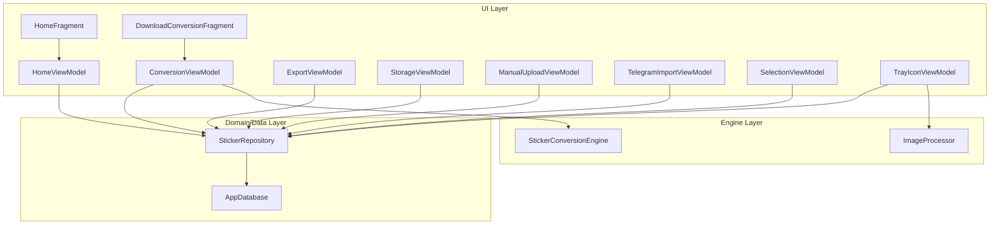
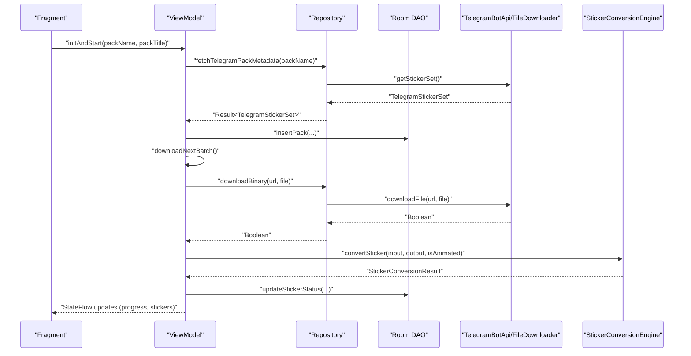
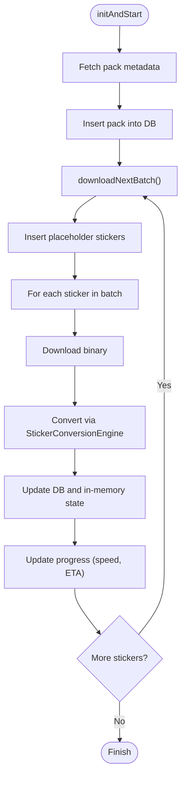
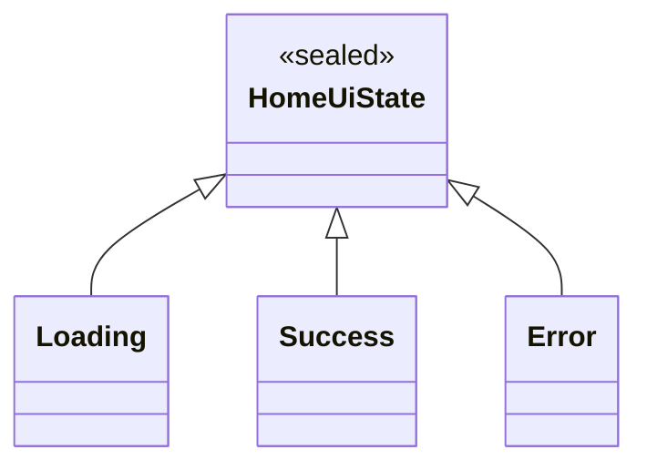
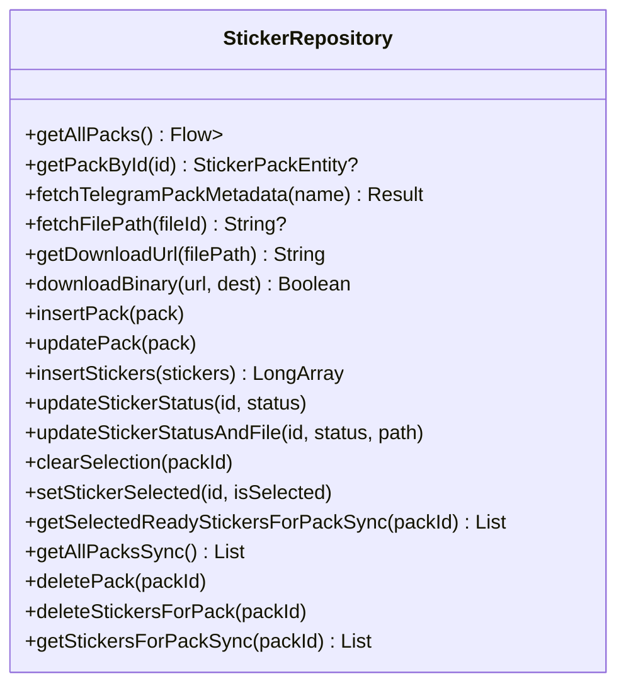
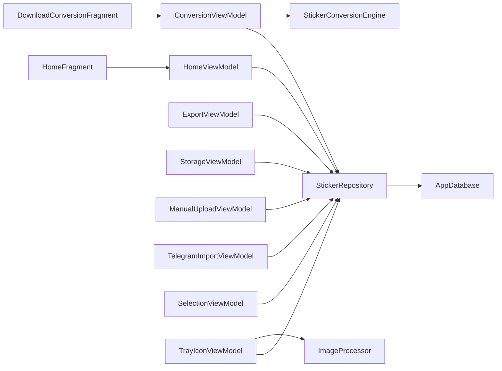

# ViewModel Architecture

<cite>
**Referenced Files in This Document**
- [ConversionViewModel.kt](file://app/src/main/java/com/maheshsharan/tel2what/ui/conversion/ConversionViewModel.kt)
- [HomeViewModel.kt](file://app/src/main/java/com/maheshsharan/tel2what/ui/home/HomeViewModel.kt)
- [ExportViewModel.kt](file://app/src/main/java/com/maheshsharan/tel2what/ui/export/ExportViewModel.kt)
- [StorageViewModel.kt](file://app/src/main/java/com/maheshsharan/tel2what/ui/storage/StorageViewModel.kt)
- [ManualUploadViewModel.kt](file://app/src/main/java/com/maheshsharan/tel2what/ui/manual/ManualUploadViewModel.kt)
- [TelegramImportViewModel.kt](file://app/src/main/java/com/maheshsharan/tel2what/ui/importpack/TelegramImportViewModel.kt)
- [SelectionViewModel.kt](file://app/src/main/java/com/maheshsharan/tel2what/ui/selection/SelectionViewModel.kt)
- [TrayIconViewModel.kt](file://app/src/main/java/com/maheshsharan/tel2what/ui/selection/TrayIconViewModel.kt)
- [StickerRepository.kt](file://app/src/main/java/com/maheshsharan/tel2what/data/repository/StickerRepository.kt)
- [AppDatabase.kt](file://app/src/main/java/com/maheshsharan/tel2what/data/local/AppDatabase.kt)
- [StickerConversionEngine.kt](file://app/src/main/java/com/maheshsharan/tel2what/engine/StickerConversionEngine.kt)
- [ImageProcessor.kt](file://app/src/main/java/com/maheshsharan/tel2what/utils/ImageProcessor.kt)
- [HomeFragment.kt](file://app/src/main/java/com/maheshsharan/tel2what/ui/home/HomeFragment.kt)
- [DownloadConversionFragment.kt](file://app/src/main/java/com/maheshsharan/tel2what/ui/conversion/DownloadConversionFragment.kt)
- [Tel2WhatApplication.kt](file://app/src/main/java/com/maheshsharan/tel2what/Tel2WhatApplication.kt)
</cite>

## Table of Contents
1. [Introduction](#introduction)
2. [Project Structure](#project-structure)
3. [Core Components](#core-components)
4. [Architecture Overview](#architecture-overview)
5. [Detailed Component Analysis](#detailed-component-analysis)
6. [Dependency Analysis](#dependency-analysis)
7. [Performance Considerations](#performance-considerations)
8. [Troubleshooting Guide](#troubleshooting-guide)
9. [Conclusion](#conclusion)
10. [Appendices](#appendices)

## Introduction
This document explains the ViewModel architecture and state management patterns used in Tel2What. It covers MVVM implementation with ViewModels, Kotlin Flows for reactive UI updates, ViewModel factories, lifecycle-aware components, and repository-driven data flows. It also documents state management strategies (loading, success, error), asynchronous operations with coroutines, configuration change handling, memory leak prevention, and testing strategies.

## Project Structure
The project follows a layered architecture:
- UI layer: Fragments and ViewModels per feature area (home, conversion, export, storage, manual upload, selection, tray icon).
- Domain/Data layer: Repository pattern encapsulating DAOs, network APIs, and file downloads.
- Engine layer: Media conversion and processing utilities.
- Utilities and Application: StrictMode setup and shared helpers.

**Diagram sources**
- [HomeFragment.kt](file://app/src/main/java/com/maheshsharan/tel2what/ui/home/HomeFragment.kt#L21-L106)
- [DownloadConversionFragment.kt](file://app/src/main/java/com/maheshsharan/tel2what/ui/conversion/DownloadConversionFragment.kt#L21-L137)
- [HomeViewModel.kt](file://app/src/main/java/com/maheshsharan/tel2what/ui/home/HomeViewModel.kt#L19-L47)
- [ConversionViewModel.kt](file://app/src/main/java/com/maheshsharan/tel2what/ui/conversion/ConversionViewModel.kt#L39-L453)
- [StickerRepository.kt](file://app/src/main/java/com/maheshsharan/tel2what/data/repository/StickerRepository.kt#L10-L80)
- [AppDatabase.kt](file://app/src/main/java/com/maheshsharan/tel2what/data/local/AppDatabase.kt#L13-L42)
- [StickerConversionEngine.kt](file://app/src/main/java/com/maheshsharan/tel2what/engine/StickerConversionEngine.kt#L17-L275)
- [ImageProcessor.kt](file://app/src/main/java/com/maheshsharan/tel2what/utils/ImageProcessor.kt#L9-L68)

**Section sources**
- [HomeFragment.kt](file://app/src/main/java/com/maheshsharan/tel2what/ui/home/HomeFragment.kt#L21-L106)
- [DownloadConversionFragment.kt](file://app/src/main/java/com/maheshsharan/tel2what/ui/conversion/DownloadConversionFragment.kt#L21-L137)
- [HomeViewModel.kt](file://app/src/main/java/com/maheshsharan/tel2what/ui/home/HomeViewModel.kt#L19-L47)
- [ConversionViewModel.kt](file://app/src/main/java/com/maheshsharan/tel2what/ui/conversion/ConversionViewModel.kt#L39-L453)
- [StickerRepository.kt](file://app/src/main/java/com/maheshsharan/tel2what/data/repository/StickerRepository.kt#L10-L80)
- [AppDatabase.kt](file://app/src/main/java/com/maheshsharan/tel2what/data/local/AppDatabase.kt#L13-L42)
- [StickerConversionEngine.kt](file://app/src/main/java/com/maheshsharan/tel2what/engine/StickerConversionEngine.kt#L17-L275)
- [ImageProcessor.kt](file://app/src/main/java/com/maheshsharan/tel2what/utils/ImageProcessor.kt#L9-L68)

## Core Components
- ViewModels: Encapsulate UI-related state and orchestrate work via coroutines and Flows.
- Repositories: Centralize data access and transformations, exposing suspending functions and Flow streams.
- Engine and Utilities: Provide media processing and image manipulation.
- Factories: Provide ViewModel instances with dependencies injected.

Key patterns:
- Reactive UI via StateFlow/SharedFlow for state exposure and collection in fragments.
- Lifecycle-aware coroutines scoped to viewModelScope.
- Repository as a façade over DAOs, network, and file operations.
- StrictMode enabled in debug builds to detect leaks and performance issues.

**Section sources**
- [HomeViewModel.kt](file://app/src/main/java/com/maheshsharan/tel2what/ui/home/HomeViewModel.kt#L19-L47)
- [ConversionViewModel.kt](file://app/src/main/java/com/maheshsharan/tel2what/ui/conversion/ConversionViewModel.kt#L39-L453)
- [ExportViewModel.kt](file://app/src/main/java/com/maheshsharan/tel2what/ui/export/ExportViewModel.kt#L13-L56)
- [StorageViewModel.kt](file://app/src/main/java/com/maheshsharan/tel2what/ui/storage/StorageViewModel.kt#L25-L132)
- [ManualUploadViewModel.kt](file://app/src/main/java/com/maheshsharan/tel2what/ui/manual/ManualUploadViewModel.kt#L33-L181)
- [TelegramImportViewModel.kt](file://app/src/main/java/com/maheshsharan/tel2what/ui/importpack/TelegramImportViewModel.kt#L25-L105)
- [SelectionViewModel.kt](file://app/src/main/java/com/maheshsharan/tel2what/ui/selection/SelectionViewModel.kt#L19-L122)
- [TrayIconViewModel.kt](file://app/src/main/java/com/maheshsharan/tel2what/ui/selection/TrayIconViewModel.kt#L17-L87)
- [StickerRepository.kt](file://app/src/main/java/com/maheshsharan/tel2what/data/repository/StickerRepository.kt#L10-L80)
- [Tel2WhatApplication.kt](file://app/src/main/java/com/maheshsharan/tel2what/Tel2WhatApplication.kt#L7-L46)

## Architecture Overview
The system adheres to MVVM:
- Views (Fragments) observe StateFlow/collect Flow emissions.
- ViewModels own state and schedule work on Dispatchers.IO or default.
- Repository mediates between DAOs, network, and file operations.
- Engine and utilities handle media transformations.

**Diagram sources**
- [DownloadConversionFragment.kt](file://app/src/main/java/com/maheshsharan/tel2what/ui/conversion/DownloadConversionFragment.kt#L58-L96)
- [ConversionViewModel.kt](file://app/src/main/java/com/maheshsharan/tel2what/ui/conversion/ConversionViewModel.kt#L66-L326)
- [StickerRepository.kt](file://app/src/main/java/com/maheshsharan/tel2what/data/repository/StickerRepository.kt#L24-L30)
- [StickerConversionEngine.kt](file://app/src/main/java/com/maheshsharan/tel2what/engine/StickerConversionEngine.kt#L33-L88)

## Detailed Component Analysis

### ConversionViewModel: Batched Conversion with Progress Tracking
- State: Uses StateFlow for ConversionProgress and stickers list.
- Work orchestration: Fetches metadata, inserts pack, batches downloads, converts asynchronously with concurrency control, and updates DB and in-memory state.
- Progress: Computes speed and ETA per batch; exposes overall and batch counters.
- Lifecycle: Uses viewModelScope; cancels children on clear; supports stop conversion.
- Factory: ConversionViewModelFactory injects repository and context.

**Diagram sources**
- [ConversionViewModel.kt](file://app/src/main/java/com/maheshsharan/tel2what/ui/conversion/ConversionViewModel.kt#L66-L326)
- [StickerConversionEngine.kt](file://app/src/main/java/com/maheshsharan/tel2what/engine/StickerConversionEngine.kt#L33-L88)

**Section sources**
- [ConversionViewModel.kt](file://app/src/main/java/com/maheshsharan/tel2what/ui/conversion/ConversionViewModel.kt#L39-L453)
- [DownloadConversionFragment.kt](file://app/src/main/java/com/maheshsharan/tel2what/ui/conversion/DownloadConversionFragment.kt#L58-L96)
- [StickerConversionEngine.kt](file://app/src/main/java/com/maheshsharan/tel2what/engine/StickerConversionEngine.kt#L17-L275)

### HomeViewModel: Reactive List with Sealed UI State
- State: Sealed class HomeUiState (Loading, Success, Error); StateFlow for uiState; Flow for recentPacks.
- Behavior: Sorts packs by date; updates uiState accordingly; catches errors and emits empty list.

**Diagram sources**
- [HomeViewModel.kt](file://app/src/main/java/com/maheshsharan/tel2what/ui/home/HomeViewModel.kt#L13-L17)

**Section sources**
- [HomeViewModel.kt](file://app/src/main/java/com/maheshsharan/tel2what/ui/home/HomeViewModel.kt#L19-L47)
- [HomeFragment.kt](file://app/src/main/java/com/maheshsharan/tel2what/ui/home/HomeFragment.kt#L52-L68)

### ExportViewModel: Pack Details and Updates
- State: Pack entity and stickers count as StateFlow.
- Behavior: Loads pack and selected ready stickers; updates pack name/author and persists.

**Section sources**
- [ExportViewModel.kt](file://app/src/main/java/com/maheshsharan/tel2what/ui/export/ExportViewModel.kt#L13-L56)

### StorageViewModel: Disk Usage and Cleanup
- State: List of PackStorageInfo and total usage bytes.
- Behavior: Calculates folder sizes recursively; clears cache or deletes packs; refreshes state on main thread.

**Section sources**
- [StorageViewModel.kt](file://app/src/main/java/com/maheshsharan/tel2what/ui/storage/StorageViewModel.kt#L25-L132)

### ManualUploadViewModel: Batch Static Conversion
- State: Selected files with statuses, processing flag, and success packId.
- Behavior: Copies URIs to cache, converts with StaticStickerConverter, generates tray icon, persists pack and stickers.

**Section sources**
- [ManualUploadViewModel.kt](file://app/src/main/java/com/maheshsharan/tel2what/ui/manual/ManualUploadViewModel.kt#L33-L181)

### TelegramImportViewModel: Import Metadata with Cache Check
- State: Sealed ImportState (Idle, Loading, Success, AlreadyDownloaded, Error).
- Behavior: Extracts pack name from URL, checks DB for existing pack, fetches metadata, validates emptiness.

**Section sources**
- [TelegramImportViewModel.kt](file://app/src/main/java/com/maheshsharan/tel2what/ui/importpack/TelegramImportViewModel.kt#L25-L105)

### SelectionViewModel: Selection Management with Limits
- State: List of selectable stickers and selected count.
- Behavior: Loads READY stickers, enforces selection caps, updates DB atomically.

**Section sources**
- [SelectionViewModel.kt](file://app/src/main/java/com/maheshsharan/tel2what/ui/selection/SelectionViewModel.kt#L19-L122)

### TrayIconViewModel: Tray Icon Generation and Persistence
- State: Sticker list, selected icon path, saved flag.
- Behavior: Generates tray icon via ImageProcessor and updates pack tray image.

**Section sources**
- [TrayIconViewModel.kt](file://app/src/main/java/com/maheshsharan/tel2what/ui/selection/TrayIconViewModel.kt#L17-L87)
- [ImageProcessor.kt](file://app/src/main/java/com/maheshsharan/tel2what/utils/ImageProcessor.kt#L17-L66)

### Repository and Data Layer
- StickerRepository exposes Flow-based queries and suspending mutations; delegates to DAO, TelegramBotApi, and FileDownloader.
- AppDatabase defines entities and DAO access with migrations.

**Diagram sources**
- [StickerRepository.kt](file://app/src/main/java/com/maheshsharan/tel2what/data/repository/StickerRepository.kt#L10-L80)

**Section sources**
- [StickerRepository.kt](file://app/src/main/java/com/maheshsharan/tel2what/data/repository/StickerRepository.kt#L10-L80)
- [AppDatabase.kt](file://app/src/main/java/com/maheshsharan/tel2what/data/local/AppDatabase.kt#L13-L42)

### Engine and Utilities
- StickerConversionEngine: Orchestrates static, animated, and mixed pipelines with concurrency control and validation.
- ImageProcessor: Generates optimized tray icons under size constraints.

**Section sources**
- [StickerConversionEngine.kt](file://app/src/main/java/com/maheshsharan/tel2what/engine/StickerConversionEngine.kt#L17-L275)
- [ImageProcessor.kt](file://app/src/main/java/com/maheshsharan/tel2what/utils/ImageProcessor.kt#L17-L66)

## Dependency Analysis
- UI depends on ViewModels via factories constructed with repository and context.
- ViewModels depend on Repository.
- Repository depends on DAO, TelegramBotApi, and FileDownloader.
- Engine and utilities are invoked by ViewModels or ViewModels’ collaborators.

**Diagram sources**
- [HomeFragment.kt](file://app/src/main/java/com/maheshsharan/tel2what/ui/home/HomeFragment.kt#L29-L34)
- [DownloadConversionFragment.kt](file://app/src/main/java/com/maheshsharan/tel2what/ui/conversion/DownloadConversionFragment.kt#L29-L34)
- [HomeViewModel.kt](file://app/src/main/java/com/maheshsharan/tel2what/ui/home/HomeViewModel.kt#L19-L47)
- [ConversionViewModel.kt](file://app/src/main/java/com/maheshsharan/tel2what/ui/conversion/ConversionViewModel.kt#L39-L453)
- [StickerRepository.kt](file://app/src/main/java/com/maheshsharan/tel2what/data/repository/StickerRepository.kt#L10-L80)
- [AppDatabase.kt](file://app/src/main/java/com/maheshsharan/tel2what/data/local/AppDatabase.kt#L13-L42)
- [StickerConversionEngine.kt](file://app/src/main/java/com/maheshsharan/tel2what/engine/StickerConversionEngine.kt#L17-L275)
- [ImageProcessor.kt](file://app/src/main/java/com/maheshsharan/tel2what/utils/ImageProcessor.kt#L9-L68)

**Section sources**
- [HomeFragment.kt](file://app/src/main/java/com/maheshsharan/tel2what/ui/home/HomeFragment.kt#L29-L34)
- [DownloadConversionFragment.kt](file://app/src/main/java/com/maheshsharan/tel2what/ui/conversion/DownloadConversionFragment.kt#L29-L34)
- [StickerRepository.kt](file://app/src/main/java/com/maheshsharan/tel2what/data/repository/StickerRepository.kt#L10-L80)
- [AppDatabase.kt](file://app/src/main/java/com/maheshsharan/tel2what/data/local/AppDatabase.kt#L13-L42)

## Performance Considerations
- Concurrency control: ConversionViewModel uses a semaphore to cap concurrent conversions; StickerConversionEngine uses semaphores for static and animated pipelines.
- Dispatchers: Heavy I/O and conversions run on Dispatchers.IO; UI updates switch back to Dispatchers.Main when needed.
- Memory hygiene: Engine recycles bitmaps; ImageProcessor compresses to target size; ViewModel cancels coroutines on clear.
- Flow-based UI: Avoids redundant recompositions by emitting precise state updates.

[No sources needed since this section provides general guidance]

## Troubleshooting Guide
- StrictMode: Enabled in debug builds to detect disk reads/writes, network on main thread, and leaks.
- Logging: ViewModels log progress and errors; engine logs metrics and failures.
- Error propagation: HomeViewModel’s catch block sets error state; ImportViewModel sets error state for invalid URLs or empty packs.
- Stop conversion: ConversionViewModel marks pending stickers as STOPPED and cancels child coroutines.

**Section sources**
- [Tel2WhatApplication.kt](file://app/src/main/java/com/maheshsharan/tel2what/Tel2WhatApplication.kt#L17-L44)
- [HomeViewModel.kt](file://app/src/main/java/com/maheshsharan/tel2what/ui/home/HomeViewModel.kt#L31-L35)
- [TelegramImportViewModel.kt](file://app/src/main/java/com/maheshsharan/tel2what/ui/importpack/TelegramImportViewModel.kt#L30-L66)
- [ConversionViewModel.kt](file://app/src/main/java/com/maheshsharan/tel2what/ui/conversion/ConversionViewModel.kt#L405-L431)

## Conclusion
Tel2What employs a robust MVVM architecture with reactive state management using Kotlin Flows and ViewModel factories. Asynchronous operations are handled safely with coroutines and lifecycle-aware scopes. The repository centralizes data access, enabling testability and separation of concerns. StrictMode and careful resource management help prevent leaks and performance regressions. The conversion pipeline demonstrates advanced concurrency control and validation to produce WhatsApp-compliant stickers.

[No sources needed since this section summarizes without analyzing specific files]

## Appendices

### State Management Patterns
- Loading/Success/Error: Sealed classes and StateFlow for UI state.
- Progress tracking: Dedicated data class with StateFlow for conversion progress.
- Selection caps: Enforced in SelectionViewModel to maintain UI constraints.

**Section sources**
- [HomeViewModel.kt](file://app/src/main/java/com/maheshsharan/tel2what/ui/home/HomeViewModel.kt#L13-L17)
- [ConversionViewModel.kt](file://app/src/main/java/com/maheshsharan/tel2what/ui/conversion/ConversionViewModel.kt#L24-L37)
- [SelectionViewModel.kt](file://app/src/main/java/com/maheshsharan/tel2what/ui/selection/SelectionViewModel.kt#L63-L65)

### Lifecycle-Aware Components and Memory Leak Prevention
- viewModelScope ensures coroutines cancel when ViewModel cleared.
- Factories construct ViewModels with repository and context to avoid retaining Activity/Fragment contexts.
- StrictMode detects leaks and slow operations.

**Section sources**
- [ConversionViewModel.kt](file://app/src/main/java/com/maheshsharan/tel2what/ui/conversion/ConversionViewModel.kt#L433-L438)
- [HomeFragment.kt](file://app/src/main/java/com/maheshsharan/tel2what/ui/home/HomeFragment.kt#L29-L34)
- [Tel2WhatApplication.kt](file://app/src/main/java/com/maheshsharan/tel2what/Tel2WhatApplication.kt#L17-L44)

### Testing Strategies
- ViewModel tests: Provide fake repository/mock DAOs; assert StateFlow emissions and coroutine effects.
- Repository tests: Mock TelegramBotApi and FileDownloader; verify DAO interactions.
- Engine tests: Validate conversion outcomes for static, animated, and mixed inputs; assert size and FPS constraints.
- UI tests: Verify UI reacts to state changes and error messages.

[No sources needed since this section provides general guidance]